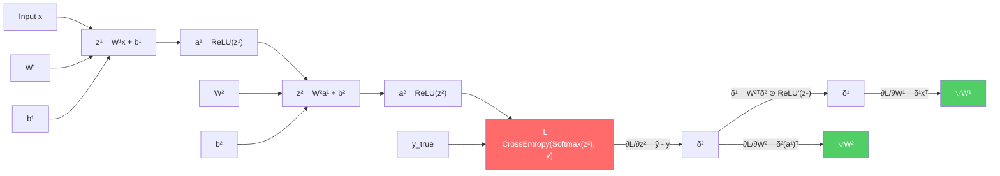
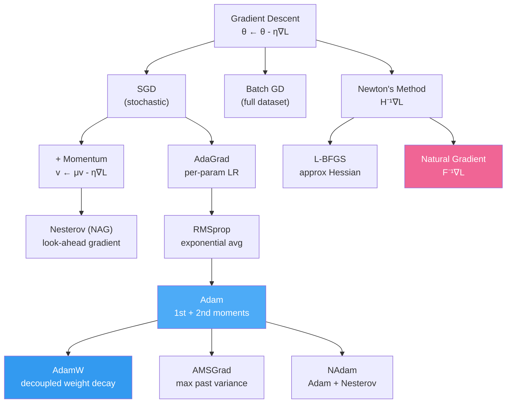
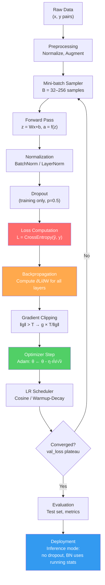

# Machine Learning Loss Functions: A Complete Reference

> A comprehensive guide to every major loss function across ML paradigms — what they are, why they exist, their mathematical form, and how to minimize them.

---

## Table of Contents

1. [Foundations](#1-foundations)
2. [Regression Losses](#2-regression-losses)
3. [Classification Losses](#3-classification-losses)
4. [Probabilistic & Bayesian Losses](#4-probabilistic--bayesian-losses)
5. [Neural Network Specific Losses](#5-neural-network-specific-losses)
6. [Generative Model Losses](#6-generative-model-losses)
7. [Ranking & Learning-to-Rank Losses](#7-ranking--learning-to-rank-losses)
8. [Clustering & Unsupervised Losses](#8-clustering--unsupervised-losses)
9. [Dimensionality Reduction Losses](#9-dimensionality-reduction-losses)
10. [Reinforcement Learning Losses](#10-reinforcement-learning-losses)
11. [Self-Supervised & Contrastive Losses](#11-self-supervised--contrastive-losses)
12. [Optimization Methods](#12-optimization-methods)
13. [Choosing the Right Loss](#13-choosing-the-right-loss)
14. [Quick Reference Table](#14-quick-reference-table)
15. [Visual Guide: Neural Networks & Backprop](#v2-forward-pass--loss--backpropagation)
16. [Visual Guide: Gradient Descent](#v3-gradient-descent--visual-intuition)
17. [Visual Guide: Normalization](#v4-normalization-techniques--visual-guide)
18. [Visual Guide: Dropout](#v5-dropout--removing-connections)
19. [Visual Guide: Optimization Algorithms](#v6-optimization-algorithms--visual--mathematical-deep-dive)
20. [Full Training Pipeline](#v7-putting-it-all-together--training-pipeline)

---

## 1. Foundations

### 1.1 What is a Loss Function?

A loss function $L(\hat{y}, y)$ measures the discrepancy between a model's prediction $\hat{y}$ and the true value $y$. The training process adjusts model parameters $\theta$ to minimize the **empirical risk**:

$$\mathcal{L}(\theta) = \frac{1}{n} \sum_{i=1}^{n} L(f_\theta(x_i), y_i)$$

### 1.2 Loss vs. Cost vs. Objective

| Term | Scope | Example |
|------|-------|---------|
| **Loss** | Single sample | $L(\hat{y}_i, y_i)$ |
| **Cost** | Entire dataset | $\frac{1}{n}\sum L_i$ |
| **Objective** | Cost + regularization | $\text{Cost} + \lambda \|\theta\|^2$ |

### 1.3 Desirable Properties of a Loss Function

- **Differentiable** (almost everywhere) — enables gradient-based optimization
- **Convex** (ideally) — guarantees a global minimum
- **Matches the task metric** — cross-entropy for classification, not MSE
- **Robust to outliers** (sometimes) — Huber, MAE over MSE

### 1.4 The Bias-Variance Decomposition via Loss

For squared loss:

$$\mathbb{E}[(y - \hat{f}(x))^2] = \text{Bias}^2[\hat{f}(x)] + \text{Var}[\hat{f}(x)] + \sigma^2_\epsilon$$

- **Bias**: error from wrong assumptions (underfitting)
- **Variance**: error from sensitivity to training data (overfitting)
- **Irreducible noise**: $\sigma^2_\epsilon$

The choice of loss function implicitly shapes this trade-off.

---

## 2. Regression Losses

### 2.1 Mean Squared Error (MSE) / L2 Loss

**Algorithm**: Linear Regression, Ridge, Neural Networks, SVR

$$L_{\text{MSE}} = \frac{1}{n} \sum_{i=1}^n (y_i - \hat{y}_i)^2$$

**Properties**:
- Differentiable everywhere
- Heavily penalizes large errors (quadratic penalty)
- Sensitive to outliers
- MLE estimator under Gaussian noise assumption

**Gradient**:

$$\frac{\partial L}{\partial \hat{y}_i} = -\frac{2}{n}(y_i - \hat{y}_i)$$

**Minimization**:
- **Closed form (Linear Regression)**: $\hat{\theta} = (X^TX)^{-1}X^Ty$
- **Gradient Descent**: $\theta \leftarrow \theta - \eta \cdot \nabla_\theta L_{\text{MSE}}$
- **Normal Equations**: Exact for linear models; $O(d^3)$ complexity

**When to use**: When large errors are more harmful than small ones; Gaussian noise assumed.

---

### 2.2 Mean Absolute Error (MAE) / L1 Loss

**Algorithm**: Median Regression, Robust Regression, LAD Regression

$$L_{\text{MAE}} = \frac{1}{n} \sum_{i=1}^n |y_i - \hat{y}_i|$$

**Properties**:
- Robust to outliers (linear penalty)
- Not differentiable at zero
- MLE under Laplacian noise assumption

**Subgradient**:

$$\frac{\partial L}{\partial \hat{y}_i} = -\frac{1}{n} \cdot \text{sign}(y_i - \hat{y}_i)$$

**Minimization**:
- **Subgradient descent**: use sign of residual
- **Linear programming**: reformulate as LP
- **Iteratively Reweighted Least Squares (IRLS)**: treat as weighted MSE iteratively

**When to use**: When outliers are present and you want median predictions.

---

### 2.3 Huber Loss

**Algorithm**: Huber Regression, Robust Neural Networks

$$L_\delta(y, \hat{y}) = \begin{cases} \frac{1}{2}(y - \hat{y})^2 & \text{if } |y - \hat{y}| \leq \delta \\ \delta \left(|y - \hat{y}| - \frac{\delta}{2}\right) & \text{otherwise} \end{cases}$$

**Properties**:
- Quadratic near zero (like MSE) → smooth gradient
- Linear for large errors (like MAE) → robust
- $\delta$ is a hyperparameter controlling the transition

**Gradient**:

$$\frac{\partial L}{\partial \hat{y}} = \begin{cases} -(y - \hat{y}) & \text{if } |y - \hat{y}| \leq \delta \\ -\delta \cdot \text{sign}(y - \hat{y}) & \text{otherwise} \end{cases}$$

**Minimization**: Standard gradient descent with the piecewise gradient above.

**When to use**: Best of both MSE and MAE; when you want robustness without losing differentiability.

---

### 2.4 Log-Cosh Loss

$$L = \frac{1}{n} \sum_{i=1}^n \log(\cosh(\hat{y}_i - y_i))$$

where $\cosh(x) = \frac{e^x + e^{-x}}{2}$.

**Properties**:
- Smooth everywhere (unlike Huber)
- $\approx \frac{x^2}{2}$ for small $x$, $\approx |x| - \log 2$ for large $x$
- Second-order differentiable → works with XGBoost

**Gradient & Hessian**:

$$\frac{\partial L}{\partial \hat{y}} = \tanh(\hat{y} - y), \quad \frac{\partial^2 L}{\partial \hat{y}^2} = 1 - \tanh^2(\hat{y} - y)$$

**Minimization**: Gradient descent; especially useful with Newton-based methods (XGBoost, LightGBM) because the Hessian is always positive.

---

### 2.5 Quantile Loss (Pinball Loss)

**Algorithm**: Quantile Regression, LightGBM quantile mode

$$L_q(y, \hat{y}) = \begin{cases} q \cdot (y - \hat{y}) & \text{if } y \geq \hat{y} \\ (1-q) \cdot (\hat{y} - y) & \text{otherwise} \end{cases}$$

**Properties**:
- $q \in (0,1)$ selects the target quantile
- $q = 0.5$ → MAE (median)
- Enables prediction intervals

**Minimization**:
- Gradient descent with asymmetric gradient
- Linear programming reformulation
- In tree models: use quantile as split criterion

**When to use**: Uncertainty estimation, prediction intervals, asymmetric cost of over/under-prediction.

---

### 2.6 Mean Squared Logarithmic Error (MSLE)

$$L_{\text{MSLE}} = \frac{1}{n} \sum_{i=1}^n (\log(1 + \hat{y}_i) - \log(1 + y_i))^2$$

**Properties**:
- Penalizes underestimates more than overestimates
- Useful for targets spanning several orders of magnitude
- Requires $\hat{y}_i \geq 0$

**Minimization**: Standard gradient descent.

**When to use**: House prices, population counts — when relative error matters more than absolute.

---

### 2.7 Mean Absolute Percentage Error (MAPE)

$$L_{\text{MAPE}} = \frac{100\%}{n} \sum_{i=1}^n \left|\frac{y_i - \hat{y}_i}{y_i}\right|$$

**Properties**:
- Scale-independent
- Undefined when $y_i = 0$
- Asymmetric — biased toward underestimation

**Symmetric MAPE (sMAPE)**:

$$L_{\text{sMAPE}} = \frac{200\%}{n} \sum \frac{|y_i - \hat{y}_i|}{|y_i| + |\hat{y}_i|}$$

**When to use**: Forecasting where relative error matters. Prefer sMAPE for symmetry.

---

### 2.8 Elastic Net (Regularized Regression)

$$L = \underbrace{\frac{1}{n}\sum(y_i - \hat{y}_i)^2}_{\text{MSE}} + \underbrace{\lambda_1 \|\theta\|_1}_{\text{L1}} + \underbrace{\lambda_2 \|\theta\|^2_2}_{\text{L2}}$$

**Properties**:
- L1 induces sparsity (feature selection)
- L2 handles correlated features (Ridge)
- Elastic Net combines both

**Minimization**:
- **Coordinate Descent**: Update one $\theta_j$ at a time with soft-thresholding
- **Soft-thresholding operator**: $S_\lambda(\beta) = \text{sign}(\beta) \max(|\beta| - \lambda, 0)$
- **ADMM**: For distributed settings

---

## 3. Classification Losses

### 3.1 Binary Cross-Entropy (Log Loss)

**Algorithm**: Logistic Regression, Binary Neural Networks

$$L_{\text{BCE}} = -\frac{1}{n} \sum_{i=1}^n \left[ y_i \log(\hat{p}_i) + (1 - y_i) \log(1 - \hat{p}_i) \right]$$

where $\hat{p}_i = \sigma(z_i) = \frac{1}{1 + e^{-z_i}}$ (sigmoid).

**Derivation**: Negative log-likelihood of Bernoulli distribution.

**Gradient w.r.t. logit $z$**:

$$\frac{\partial L}{\partial z_i} = \hat{p}_i - y_i$$

This elegant form arises because the sigmoid derivative cancels with the log.

**Minimization**:
- **Newton-Raphson / IRLS**: Fast convergence for logistic regression
- **Gradient Descent**: $\theta \leftarrow \theta + \frac{1}{n} X^T(y - \hat{p})$
- **L-BFGS**: Preferred for medium-sized datasets (quasi-Newton)
- **SGD with Adam**: For neural networks

**Why not MSE for classification?**
- MSE with sigmoid → non-convex loss landscape
- BCE is convex w.r.t. logits → guaranteed global minimum

---

### 3.2 Categorical Cross-Entropy

**Algorithm**: Multiclass Logistic Regression, Softmax Classifier, Neural Networks

$$L_{\text{CCE}} = -\frac{1}{n} \sum_{i=1}^n \sum_{k=1}^K y_{ik} \log(\hat{p}_{ik})$$

where $\hat{p}_{ik} = \frac{e^{z_{ik}}}{\sum_j e^{z_{ij}}}$ (softmax).

**Gradient w.r.t. logit $z_{ik}$**:

$$\frac{\partial L}{\partial z_{ik}} = \hat{p}_{ik} - y_{ik}$$

Again, the softmax Jacobian simplifies beautifully.

**Numerical stability**: Compute $\log(\text{softmax}(z)) = z_k - \log\sum_j e^{z_j}$ using the log-sum-exp trick:

$$\log\sum_j e^{z_j} = c + \log\sum_j e^{z_j - c}, \quad c = \max_j z_j$$

**Minimization**: Same as binary — gradient descent, Adam, L-BFGS.

---

### 3.3 Hinge Loss (SVM)

**Algorithm**: Support Vector Machine (SVM), SVMs for ranking

$$L_{\text{hinge}} = \frac{1}{n} \sum_{i=1}^n \max(0, 1 - y_i \cdot \hat{y}_i)$$

where $y_i \in \{-1, +1\}$ and $\hat{y}_i = w^T x_i + b$.

**Properties**:
- Zero loss for correctly classified points beyond the margin
- Linear penalty for margin violations
- Not differentiable at $y_i \hat{y}_i = 1$

**Subgradient**:

$$\frac{\partial L}{\partial w} = \begin{cases} 0 & \text{if } y_i (w^T x_i + b) \geq 1 \\ -y_i x_i & \text{otherwise} \end{cases}$$

**Full SVM Objective** (with L2 regularization):

$$\min_w \frac{1}{2}\|w\|^2 + C \sum_i \max(0, 1 - y_i w^T x_i)$$

**Minimization**:
- **Dual formulation (QP)**: Solve via quadratic programming using Lagrange multipliers
- **SMO (Sequential Minimal Optimization)**: Solve smallest possible QP sub-problem at each step
- **Pegasos (Primal SGD)**: Online SGD on the primal; simple and scalable
- **Kernel trick**: Replace $x^T x'$ with $K(x, x')$ without explicit feature maps

---

### 3.4 Squared Hinge Loss

$$L = \frac{1}{n} \sum_i \max(0, 1 - y_i \hat{y}_i)^2$$

**Properties**:
- Differentiable everywhere
- Penalizes margin violations quadratically
- More sensitive to outliers than hinge

**Minimization**: Gradient descent (gradient is defined everywhere).

---

### 3.5 Multiclass Hinge Loss (Crammer-Singer)

$$L = \frac{1}{n} \sum_i \sum_{k \neq y_i} \max(0, 1 + \hat{y}_{ik} - \hat{y}_{iy_i})$$

**Minimization**: Multiclass SMO or subgradient methods.

---

### 3.6 Focal Loss

**Algorithm**: RetinaNet, Object Detection in imbalanced settings

$$L_{\text{FL}} = -\frac{1}{n} \sum_i (1 - \hat{p}_i)^\gamma y_i \log(\hat{p}_i)$$

where $\gamma \geq 0$ is the focusing parameter.

**Properties**:
- When $\gamma = 0$: standard cross-entropy
- When $\gamma > 0$: down-weights easy examples (high $\hat{p}$)
- Lets the model focus on hard, misclassified examples
- Useful for extreme class imbalance (e.g., 1000:1 background:object)

**Gradient**: Combines the derivative of BCE with an additional $(1-\hat{p})^\gamma$ factor.

**Minimization**: Standard SGD/Adam with this modified gradient.

---

### 3.7 Kullback-Leibler Divergence (KL Divergence)

$$D_{KL}(P \| Q) = \sum_x P(x) \log \frac{P(x)}{Q(x)}$$

**Properties**:
- Not symmetric: $D_{KL}(P\|Q) \neq D_{KL}(Q\|P)$
- Non-negative: $D_{KL}(P\|Q) \geq 0$ (Gibbs' inequality)
- $D_{KL} = 0$ iff $P = Q$
- $\text{Cross-Entropy}(P, Q) = H(P) + D_{KL}(P\|Q)$

**Forward vs. Reverse KL**:
- **Forward KL** $D_{KL}(P\|Q)$: $Q$ must cover all of $P$ → **mean-seeking**
- **Reverse KL** $D_{KL}(Q\|P)$: $Q$ finds a mode of $P$ → **mode-seeking**

**Minimization**: Gradient on $Q$ parameters; in VAEs, use reparameterization trick.

---

### 3.8 Zero-One Loss

$$L_{0/1} = \frac{1}{n} \sum_i \mathbf{1}[\hat{y}_i \neq y_i]$$

**Properties**:
- The "true" classification loss we care about
- Non-differentiable, non-convex → cannot use gradient descent directly
- All other classification losses are convex surrogates for this

**Minimization**: NP-hard in general. Use surrogate losses instead.

---

## 4. Probabilistic & Bayesian Losses

### 4.1 Negative Log-Likelihood (NLL)

**Algorithm**: Maximum Likelihood Estimation (all probabilistic models)

$$L_{\text{NLL}} = -\frac{1}{n} \sum_{i=1}^n \log p_\theta(y_i | x_i)$$

**Connection to other losses**:
- Gaussian $p$ → MSE
- Bernoulli $p$ → Binary Cross-Entropy
- Categorical $p$ → Categorical Cross-Entropy
- Laplace $p$ → MAE
- Poisson $p$ → Poisson deviance

This unifies regression and classification losses under a single framework.

**Minimization**: Gradient descent on NLL is equivalent to maximizing the log-likelihood.

---

### 4.2 Evidence Lower Bound (ELBO) — Variational Inference

**Algorithm**: Variational Autoencoders (VAE), Bayesian Neural Networks

$$\mathcal{L}_{\text{ELBO}} = \mathbb{E}_{q(z|x)}[\log p(x|z)] - D_{KL}(q(z|x) \| p(z))$$

**Two terms**:
1. **Reconstruction loss**: How well we reconstruct $x$ from $z$
2. **KL regularization**: How much the approximate posterior $q(z|x)$ deviates from the prior $p(z)$

We **maximize** ELBO (equivalently, minimize negative ELBO).

**Why ELBO?** The true marginal $\log p(x) = \mathcal{L}_{\text{ELBO}} + D_{KL}(q\|p)$ is intractable; ELBO is a tractable lower bound.

**Reparameterization trick** (enables backprop through sampling):

$$z = \mu + \sigma \odot \epsilon, \quad \epsilon \sim \mathcal{N}(0, I)$$

**Minimization**: Adam/SGD on the reparameterized gradient.

---

### 4.3 Poisson Loss (Poisson Deviance)

**Algorithm**: Poisson Regression, count data prediction

$$L_{\text{Poisson}} = \frac{1}{n} \sum_i (\hat{y}_i - y_i \log \hat{y}_i)$$

**Properties**:
- Derived from Poisson log-likelihood
- Natural for count data (insurance claims, web traffic)
- Requires $\hat{y}_i > 0$

**Minimization**: Gradient descent. In GLMs, solved via IRLS.

---

### 4.4 Gamma / Tweedie Loss

**Algorithm**: GLMs for insurance, finance

**Gamma Loss** (for positive, right-skewed targets):

$$L_{\text{Gamma}} = \frac{1}{n} \sum_i \left(\frac{y_i}{\hat{y}_i} - \log \frac{y_i}{\hat{y}_i} - 1\right)$$

**Tweedie Loss** (unifies Gaussian, Poisson, Gamma via power $p$):

$$L_{\text{Tweedie}} = \frac{1}{n} \sum_i \left(\frac{y_i^{2-p}}{(1-p)(2-p)} - \frac{y_i \hat{y}_i^{1-p}}{1-p} + \frac{\hat{y}_i^{2-p}}{2-p}\right)$$

- $p=0$: Gaussian (MSE)
- $p=1$: Poisson
- $p=2$: Gamma
- $1 < p < 2$: Compound Poisson-Gamma (mixed zero + continuous)

---

### 4.5 Maximum A Posteriori (MAP) and Regularization

**Bayesian perspective on regularization**:

$$\underbrace{-\log p(\theta | \mathcal{D})}_{\text{MAP objective}} = \underbrace{-\log p(\mathcal{D}|\theta)}_{\text{NLL}} - \underbrace{\log p(\theta)}_{\text{log prior}}$$

| Prior | Regularization |
|-------|---------------|
| Gaussian $\mathcal{N}(0, \lambda^{-1}I)$ | L2 (Ridge) |
| Laplace | L1 (Lasso) |
| Spike-and-slab | L0 (sparsity) |

**Minimization**: Same as regularized NLL.

---

## 5. Neural Network Specific Losses

### 5.1 Softmax Cross-Entropy (with temperature)

$$L = -\frac{1}{n}\sum_i \log \frac{e^{z_{iy_i}/T}}{\sum_k e^{z_{ik}/T}}$$

**Temperature $T$**:
- $T \to 0$: one-hot (argmax)
- $T = 1$: standard softmax
- $T \to \infty$: uniform distribution (maximum entropy)

Used in **knowledge distillation** (soft targets from teacher).

---

### 5.2 Label Smoothing Loss

**Algorithm**: Regularization in image classification, NLP

$$L_{\text{LS}} = (1 - \epsilon) L_{\text{CE}} + \epsilon \cdot H(\text{uniform}, \hat{p})$$

Equivalent to replacing hard labels $y_k$ with:

$$\tilde{y}_k = (1-\epsilon) y_k + \frac{\epsilon}{K}$$

**Properties**:
- Prevents overconfident predictions
- Penalizes the model for being too certain
- Improves calibration and generalization

**Minimization**: Standard gradient descent on the smoothed targets.

---

### 5.3 Connectionist Temporal Classification (CTC) Loss

**Algorithm**: Speech recognition (RNNs, transformers), OCR

$$L_{\text{CTC}} = -\log \sum_{\pi \in \mathcal{B}^{-1}(y)} p(\pi | x)$$

where $\mathcal{B}$ is a many-to-one mapping (collapsing repeated symbols and blanks).

**Key idea**: Marginalizes over all valid alignments between input sequence and output labels — no need for frame-level labels.

**Minimization**: Forward-backward dynamic programming to compute gradient efficiently; then backprop.

---

### 5.4 Sequence-to-Sequence Loss (Teacher Forcing)

**Algorithm**: LSTMs, GRUs, Transformers for sequence generation

$$L = -\sum_{t=1}^T \log p_\theta(y_t | y_{<t}, x)$$

**Teacher forcing**: Feed ground-truth tokens during training (not predicted ones).

**Exposure bias**: At inference, model sees its own outputs → distribution shift. Mitigated by:
- **Scheduled sampling**: Gradually replace ground-truth with predictions during training
- **REINFORCE**: Use RL to optimize sequence-level rewards

**Minimization**: Standard backpropagation through time (BPTT).

---

### 5.5 Perceptual Loss

**Algorithm**: Style Transfer, Super-Resolution, Image Generation

$$L_{\text{perceptual}} = \sum_j \frac{1}{C_j H_j W_j} \| \phi_j(\hat{x}) - \phi_j(x) \|^2$$

where $\phi_j$ is the activation of layer $j$ in a pretrained VGG network.

**Properties**:
- Captures high-level semantic similarity
- Produces sharper, more visually pleasing outputs than pixel-wise MSE

**Minimization**: Gradient flows through the generator; VGG is frozen.

---

### 5.6 Dice Loss

**Algorithm**: Medical image segmentation (U-Net)

$$L_{\text{Dice}} = 1 - \frac{2 |P \cap G|}{|P| + |G|}$$

$$= 1 - \frac{2 \sum_i p_i g_i}{\sum_i p_i + \sum_i g_i}$$

**Properties**:
- Handles severe class imbalance (e.g., small tumors)
- Directly optimizes the F1 score
- Smooth version adds $\epsilon$ to numerator and denominator

**Minimization**: Gradient through soft (differentiable) version.

---

### 5.7 Intersection over Union (IoU) Loss

**Algorithm**: Object Detection, Segmentation (YOLO, Mask R-CNN)

$$L_{\text{IoU}} = 1 - \frac{|A \cap B|}{|A \cup B|}$$

**Variants**:
- **GIoU**: Adds a penalty for non-overlapping boxes
- **DIoU**: Adds center-point distance penalty
- **CIoU**: Adds aspect ratio consistency

**CIoU**:

$$L_{\text{CIoU}} = 1 - \text{IoU} + \frac{\rho^2(b, b^{gt})}{c^2} + \alpha v$$

where $\rho$ is center distance, $c$ is diagonal of enclosing box, $v$ measures aspect ratio consistency.

---

### 5.8 Triplet Loss

**Algorithm**: Siamese Networks, FaceNet, embedding learning

$$L_{\text{triplet}} = \max(0, \|f(a) - f(p)\|^2 - \|f(a) - f(n)\|^2 + \alpha)$$

**Variables**:
- $a$: anchor sample
- $p$: positive (same class as anchor)
- $n$: negative (different class)
- $\alpha$: margin

**Properties**:
- Learns a metric space where same-class embeddings cluster together
- Hard negative mining is critical for training efficiency

**Minimization**: SGD; use hard/semi-hard negative mining to get useful gradients.

---

### 5.9 Center Loss

**Algorithm**: Face recognition (with cross-entropy)

$$L_{\text{center}} = \frac{1}{2} \sum_i \|f(x_i) - c_{y_i}\|^2$$

where $c_{y_i}$ is the center (mean embedding) of class $y_i$.

**Combined loss**: $L = L_{\text{CE}} + \lambda L_{\text{center}}$

**Minimization**: Update centers during training as moving averages.

---

### 5.10 ArcFace / CosFace Loss (Angular Losses)

**Algorithm**: Face recognition (state-of-the-art)

**CosFace** (Large Margin Cosine Loss):

$$L = -\frac{1}{n}\sum_i \log \frac{e^{s(\cos\theta_{y_i} - m)}}{e^{s(\cos\theta_{y_i} - m)} + \sum_{k \neq y_i} e^{s \cos\theta_k}}$$

**ArcFace** (Additive Angular Margin):

$$L = -\frac{1}{n}\sum_i \log \frac{e^{s \cos(\theta_{y_i} + m)}}{e^{s \cos(\theta_{y_i} + m)} + \sum_{k \neq y_i} e^{s \cos\theta_k}}$$

**Properties**:
- Operates on the angular (cosine) space
- More discriminative decision boundaries
- $s$ (scale) and $m$ (margin) are hyperparameters

---

## 6. Generative Model Losses

### 6.1 GAN Loss (Vanilla GAN)

**Algorithm**: Generative Adversarial Networks

**Minimax objective**:

$$\min_G \max_D \mathbb{E}_{x \sim p_{\text{data}}}[\log D(x)] + \mathbb{E}_{z \sim p_z}[\log(1 - D(G(z)))]$$

**Discriminator** maximizes: distinguish real from fake
**Generator** minimizes: fool the discriminator

**Problems**:
- **Mode collapse**: Generator produces limited variety
- **Vanishing gradient**: When $D$ is too confident, $\nabla_G \approx 0$
- **Training instability**: Minimax can oscillate

**Minimization**:
- Alternate gradient updates: update $D$ $k$ times, then update $G$ once
- Use non-saturating loss for generator: $-\mathbb{E}[\log D(G(z))]$ instead of $\mathbb{E}[\log(1-D(G(z)))]$

---

### 6.2 Wasserstein GAN (WGAN) Loss

**Algorithm**: Improved GAN training

$$L_W = \mathbb{E}_{x \sim p_{\text{data}}}[D(x)] - \mathbb{E}_{z \sim p_z}[D(G(z))]$$

**Key insight**: Uses Earth Mover's (Wasserstein) distance instead of JS divergence.

**Requirements**:
- Discriminator must be **1-Lipschitz** (called "critic" in WGAN)
- Enforced via weight clipping (WGAN) or gradient penalty (WGAN-GP)

**WGAN-GP** (Gradient Penalty):

$$L_{\text{GP}} = \lambda \mathbb{E}_{\hat{x}}[(\|\nabla_{\hat{x}} D(\hat{x})\|_2 - 1)^2]$$

where $\hat{x}$ is sampled along lines between real and fake examples.

**Benefits**: More stable training, meaningful loss curves (correlated with quality).

---

### 6.3 Least Squares GAN (LSGAN)

$$\min_D \frac{1}{2}\mathbb{E}[(D(x) - 1)^2] + \frac{1}{2}\mathbb{E}[(D(G(z)))^2]$$
$$\min_G \frac{1}{2}\mathbb{E}[(D(G(z)) - 1)^2]$$

**Properties**:
- Penalizes samples even when correctly classified but far from decision boundary
- Solves vanishing gradient problem of vanilla GAN
- More stable training

---

### 6.4 Conditional GAN (cGAN)

$$\min_G \max_D \mathbb{E}[\log D(x|y)] + \mathbb{E}[\log(1 - D(G(z|y)|y))]$$

Conditions both generator and discriminator on label $y$.

---

### 6.5 VAE Loss (Revisited)

$$L_{\text{VAE}} = \underbrace{\mathbb{E}_{q_\phi(z|x)}[\log p_\theta(x|z)]}_{\text{Reconstruction}} - \underbrace{D_{KL}(q_\phi(z|x) \| p(z))}_{\text{KL divergence}}$$

For Gaussian prior $p(z) = \mathcal{N}(0, I)$ and $q_\phi(z|x) = \mathcal{N}(\mu, \text{diag}(\sigma^2))$:

$$D_{KL} = -\frac{1}{2} \sum_j (1 + \log\sigma_j^2 - \mu_j^2 - \sigma_j^2)$$

**$\beta$-VAE**: $L = \text{Reconstruction} - \beta \cdot D_{KL}$, where $\beta > 1$ encourages disentanglement.

---

### 6.6 Diffusion Model Loss (DDPM)

**Algorithm**: Denoising Diffusion Probabilistic Models

**Forward process** (adds noise):

$$q(x_t | x_{t-1}) = \mathcal{N}(x_t; \sqrt{1-\beta_t}x_{t-1}, \beta_t I)$$

**Training objective** (simplified):

$$L_{\text{simple}} = \mathbb{E}_{t, x_0, \epsilon}\left[\|\epsilon - \epsilon_\theta(x_t, t)\|^2\right]$$

The model $\epsilon_\theta$ learns to predict the noise $\epsilon$ added at step $t$.

**Derivation**: Variational bound on $-\log p_\theta(x_0)$. The simplified loss is a reweighted version.

**Minimization**: Standard MSE gradient; model is a U-Net conditioned on timestep $t$.

---

### 6.7 Flow-Based Model Loss (Normalizing Flows)

**Algorithm**: RealNVP, Glow, MAF

$$L = -\frac{1}{n}\sum_i \left[\log p_Z(f(x_i)) + \log\left|\det \frac{\partial f}{\partial x_i}\right|\right]$$

**Two terms**:
1. **Log-prob of transformed latent**: How likely is $z = f(x)$ under the prior?
2. **Log absolute Jacobian determinant**: Volume change from $x \to z$

**Key**: $f$ must be invertible with tractable Jacobian (coupling layers, autoregressive transforms).

**Minimization**: Exact gradient via backprop through the invertible network.

---

## 7. Ranking & Learning-to-Rank Losses

### 7.1 Pointwise Ranking Loss

Treat each query-document pair independently with regression or classification loss. Simple but ignores relative ordering.

---

### 7.2 Pairwise Ranking Loss (RankNet)

**Algorithm**: RankNet, LambdaRank, LambdaMART

$$L_{\text{pair}} = \sum_{(i,j): y_i > y_j} \log(1 + e^{-(s_i - s_j)})$$

**Idea**: For every pair where $i$ should rank higher than $j$, penalize the score ordering violation.

**LambdaRank**: Reweights pairwise gradients by the change in IR metric (NDCG):

$$\lambda_{ij} = \frac{-\sigma}{1 + e^{\sigma(s_i - s_j)}} |\Delta\text{NDCG}_{ij}|$$

**LambdaMART**: Uses gradient boosted trees with LambdaRank gradients.

**Minimization**: Gradient descent on pairwise probabilities.

---

### 7.3 Listwise Ranking Loss (ListNet, ListMLE)

**ListNet**:

$$L = -\sum_k P_y(k) \log P_s(k)$$

where $P(k) = \frac{e^{y_k}}{\sum_j e^{y_j}}$ is the top-1 probability.

**ListMLE**:

$$L = -\log P(\pi^* | s) = -\sum_{k=1}^n \log \frac{e^{s_{\pi^*(k)}}}{\sum_{j=k}^n e^{s_{\pi^*(j)}}}$$

Directly optimizes the likelihood of the correct permutation.

---

### 7.4 Maximum Mean Discrepancy (MMD)

**Algorithm**: Domain adaptation, two-sample tests

$$\text{MMD}^2(P, Q) = \mathbb{E}_{x,x' \sim P}[k(x,x')] - 2\mathbb{E}_{x \sim P, y \sim Q}[k(x,y)] + \mathbb{E}_{y,y' \sim Q}[k(y,y')]$$

Used in **MMD-GAN** and **domain adaptation** to match feature distributions.

---

## 8. Clustering & Unsupervised Losses

### 8.1 K-Means Loss (Inertia)

**Algorithm**: K-Means Clustering

$$L_{\text{KMeans}} = \sum_{k=1}^K \sum_{x_i \in C_k} \|x_i - \mu_k\|^2$$

**Properties**:
- NP-hard to minimize globally
- Lloyd's algorithm finds a local minimum

**Lloyd's Algorithm (EM for K-Means)**:

1. **E-step**: Assign each $x_i$ to nearest centroid $\mu_k$
2. **M-step**: Update each centroid as $\mu_k = \frac{1}{|C_k|}\sum_{x_i \in C_k} x_i$
3. Repeat until convergence

**Convergence**: Always converges (loss is monotonically non-increasing), but to a local minimum.

**K-Means++**: Smart initialization — select centroids with probability proportional to $\|x - \mu_{\text{nearest}}\|^2$.

---

### 8.2 Gaussian Mixture Model (GMM) Loss

**Algorithm**: EM for GMMs

$$L_{\text{GMM}} = -\sum_{i=1}^n \log \sum_{k=1}^K \pi_k \mathcal{N}(x_i | \mu_k, \Sigma_k)$$

**EM Algorithm**:

**E-step**: Compute responsibilities

$$r_{ik} = \frac{\pi_k \mathcal{N}(x_i|\mu_k,\Sigma_k)}{\sum_j \pi_j \mathcal{N}(x_i|\mu_j,\Sigma_j)}$$

**M-step**: Update parameters

$$\mu_k = \frac{\sum_i r_{ik} x_i}{\sum_i r_{ik}}, \quad \Sigma_k = \frac{\sum_i r_{ik}(x_i-\mu_k)(x_i-\mu_k)^T}{\sum_i r_{ik}}, \quad \pi_k = \frac{\sum_i r_{ik}}{n}$$

**Convergence**: EM monotonically increases log-likelihood; converges to local maximum.

---

### 8.3 Self-Organizing Map (SOM) Loss

$$L_{\text{SOM}} = \sum_i \sum_k h(k, \text{BMU}(x_i)) \|x_i - w_k\|^2$$

where $h$ is a neighborhood function (Gaussian), BMU is the Best Matching Unit.

---

### 8.4 Deep Clustering Loss (DEC)

**Algorithm**: Deep Embedded Clustering

**Soft assignment**:

$$q_{ij} = \frac{(1 + \|z_i - \mu_j\|^2/\alpha)^{-(\alpha+1)/2}}{\sum_j (1 + \|z_i - \mu_j\|^2/\alpha)^{-(\alpha+1)/2}}$$

**Auxiliary target distribution**:

$$p_{ij} = \frac{q_{ij}^2 / \sum_i q_{ij}}{\sum_j (q_{ij}^2 / \sum_i q_{ij})}$$

**Loss**:

$$L_{\text{DEC}} = D_{KL}(P \| Q) = \sum_i \sum_j p_{ij} \log \frac{p_{ij}}{q_{ij}}$$

---

## 9. Dimensionality Reduction Losses

### 9.1 PCA Reconstruction Loss

**Algorithm**: Principal Component Analysis

$$L_{\text{PCA}} = \frac{1}{n}\sum_{i=1}^n \|x_i - WW^T x_i\|^2$$

where $W \in \mathbb{R}^{d \times k}$ has orthonormal columns.

**Minimization**: SVD of the data matrix $X = U\Sigma V^T$; the top-$k$ right singular vectors are the principal components.

**Equivalent objective**: Maximize variance of projections:

$$\max_{W: W^TW = I} \text{tr}(W^T \Sigma W)$$

where $\Sigma = \frac{1}{n}X^TX$ is the covariance.

---

### 9.2 Autoencoder Reconstruction Loss

**Algorithm**: Autoencoders, Denoising Autoencoders

$$L_{\text{AE}} = \frac{1}{n}\sum_i \|x_i - \hat{x}_i\|^2 = \frac{1}{n}\sum_i \|x_i - D(E(x_i))\|^2$$

**Denoising AE**: Train to reconstruct $x$ from corrupted $\tilde{x} = x + \epsilon$:

$$L_{\text{DAE}} = \frac{1}{n}\sum_i \|x_i - D(E(\tilde{x}_i))\|^2$$

**Sparse AE**: Add L1 penalty on activations:

$$L_{\text{sparse}} = L_{\text{AE}} + \lambda \|h\|_1$$

---

### 9.3 t-SNE Loss (KL on Neighborhood Distributions)

**Algorithm**: t-SNE

**High-dimensional similarities**:

$$p_{j|i} = \frac{\exp(-\|x_i - x_j\|^2 / 2\sigma_i^2)}{\sum_{k \neq i} \exp(-\|x_i - x_k\|^2 / 2\sigma_i^2)}, \quad p_{ij} = \frac{p_{j|i} + p_{i|j}}{2n}$$

**Low-dimensional similarities** (Student-t, heavy tails):

$$q_{ij} = \frac{(1 + \|y_i - y_j\|^2)^{-1}}{\sum_{k \neq l}(1 + \|y_k - y_l\|^2)^{-1}}$$

**Loss**:

$$L_{\text{t-SNE}} = D_{KL}(P \| Q) = \sum_{i \neq j} p_{ij} \log \frac{p_{ij}}{q_{ij}}$$

**Gradient**:

$$\frac{\partial L}{\partial y_i} = 4\sum_j (p_{ij} - q_{ij})(y_i - y_j)(1 + \|y_i - y_j\|^2)^{-1}$$

**Minimization**: Gradient descent with momentum. The heavy-tailed $q$ prevents crowding.

---

### 9.4 UMAP Loss

**Algorithm**: Uniform Manifold Approximation and Projection

**Cross-entropy between high-D and low-D fuzzy simplicial sets**:

$$L_{\text{UMAP}} = \sum_{(i,j)} \left[ w_{ij} \log \frac{w_{ij}}{v_{ij}} + (1 - w_{ij})\log\frac{1 - w_{ij}}{1 - v_{ij}} \right]$$

where:
- $w_{ij}$: high-dimensional fuzzy weights (based on distance to $k$-NN)
- $v_{ij}$: low-dimensional weights using Student-t-like kernel

**Attractive forces** (for $w_{ij} > 0$) + **Repulsive forces** (for sampled negatives).

**Minimization**: SGD with negative sampling (similar to word2vec).

---

### 9.5 NMF Loss (Non-negative Matrix Factorization)

**Algorithm**: NMF, topic modeling

$$L_{\text{NMF}} = \|V - WH\|_F^2 \quad \text{subject to } W, H \geq 0$$

**Multiplicative Updates** (Lee & Seung):

$$H \leftarrow H \odot \frac{W^T V}{W^T W H}, \quad W \leftarrow W \odot \frac{V H^T}{W H H^T}$$

These updates guarantee non-negativity and monotonic decrease of $L$.

---

## 10. Reinforcement Learning Losses

### 10.1 Policy Gradient Loss (REINFORCE)

**Algorithm**: REINFORCE, Actor-Critic

$$L_{\text{PG}} = -\mathbb{E}_\tau \left[ \sum_t \log \pi_\theta(a_t | s_t) \cdot G_t \right]$$

where $G_t = \sum_{t'=t}^T \gamma^{t'-t} r_{t'}$ is the return.

**Policy Gradient Theorem**:

$$\nabla_\theta J(\theta) = \mathbb{E}_\tau \left[ \sum_t \nabla_\theta \log \pi_\theta(a_t | s_t) \cdot G_t \right]$$

**Variance reduction**: Subtract a baseline $b(s_t)$ (e.g., value function $V(s_t)$):

$$\nabla_\theta J(\theta) = \mathbb{E}_\tau \left[ \sum_t \nabla_\theta \log \pi_\theta(a_t | s_t) \cdot (G_t - b(s_t)) \right]$$

**Minimization**: SGD with Monte Carlo estimates of the gradient. High variance; use many rollouts.

---

### 10.2 Temporal Difference (TD) Loss

**Algorithm**: Q-Learning, SARSA, DQN

**TD Error (Bellman residual)**:

$$\delta_t = r_t + \gamma V(s_{t+1}) - V(s_t)$$

**TD(0) Loss**:

$$L_{\text{TD}} = \mathbb{E}\left[\delta_t^2\right] = \mathbb{E}\left[(r_t + \gamma V(s_{t+1}) - V(s_t))^2\right]$$

**DQN Loss**:

$$L_{\text{DQN}} = \mathbb{E}\left[(r + \gamma \max_{a'} Q(s', a'; \theta^-) - Q(s, a; \theta))^2\right]$$

where $\theta^-$ are the target network parameters (copied from $\theta$ periodically).

**Minimization**:
- **Gradient** only through $Q(s,a;\theta)$; stop gradient on target
- **Replay buffer**: Sample random transitions to break correlations
- **Target network**: Stabilizes training

---

### 10.3 Advantage Actor-Critic (A2C/A3C) Loss

$$L_{\text{A2C}} = \underbrace{-\log \pi_\theta(a|s) \cdot A(s,a)}_{\text{actor (policy)}} + \underbrace{\beta_v (V_\phi(s) - G_t)^2}_{\text{critic (value)}} - \underbrace{\beta_e H(\pi_\theta(\cdot|s))}_{\text{entropy bonus}}$$

**Advantage**: $A(s, a) = Q(s,a) - V(s) \approx r + \gamma V(s') - V(s)$

**Entropy bonus**: Encourages exploration (discourages premature convergence).

**Minimization**: Simultaneously update actor and critic parameters.

---

### 10.4 Proximal Policy Optimization (PPO) Loss

**Algorithm**: PPO (most popular RL algorithm)

**Clipped objective**:

$$L_{\text{PPO}} = -\mathbb{E}_t \left[ \min\left(r_t(\theta) A_t, \text{clip}(r_t(\theta), 1-\epsilon, 1+\epsilon) A_t\right) \right]$$

where $r_t(\theta) = \frac{\pi_\theta(a_t|s_t)}{\pi_{\theta_{\text{old}}}(a_t|s_t)}$ is the probability ratio.

**Properties**:
- Prevents large policy updates (trust region without second-order optimization)
- $\epsilon \approx 0.1$–$0.2$ is the clipping parameter
- More stable than vanilla policy gradient

**Full PPO Loss**:

$$L_{\text{total}} = L_{\text{PPO}} + c_1 L_{\text{VF}} - c_2 H[\pi_\theta]$$

**Minimization**: Multiple gradient steps on the same batch (typically 4–10 epochs).

---

### 10.5 Soft Actor-Critic (SAC) Loss

**Algorithm**: SAC (off-policy, maximum entropy RL)

**Policy objective** (maximize return + entropy):

$$J(\pi) = \mathbb{E}\left[\sum_t \gamma^t (r_t + \alpha H(\pi(\cdot|s_t)))\right]$$

**Critic loss**:

$$L_Q = \mathbb{E}\left[(Q(s,a) - y)^2\right], \quad y = r + \gamma (Q_{\text{target}}(s',a') - \alpha \log \pi(a'|s'))$$

**Actor loss**:

$$L_\pi = \mathbb{E}\left[\alpha \log \pi(a|s) - Q(s,a)\right]$$

**Temperature $\alpha$ loss** (auto-tuning):

$$L_\alpha = \mathbb{E}\left[-\alpha (\log \pi(a|s) + \mathcal{H}_{\text{target}})\right]$$

---

### 10.6 RLHF Loss (Reinforcement Learning from Human Feedback)

**Algorithm**: InstructGPT, ChatGPT, Claude fine-tuning

**Step 1 — Reward Model Training** (Bradley-Terry model):

$$L_{\text{RM}} = -\mathbb{E}_{(x, y_w, y_l)}\left[\log \sigma(r_\theta(x, y_w) - r_\theta(x, y_l))\right]$$

where $y_w$ is preferred over $y_l$ by humans.

**Step 2 — PPO with KL penalty**:

$$L_{\text{RLHF}} = \mathbb{E}\left[r_\theta(x, y) - \beta \cdot D_{KL}(\pi_\phi(\cdot|x) \| \pi_{\text{ref}}(\cdot|x))\right]$$

The KL term prevents the policy from deviating too far from the reference (SFT) model.

---

### 10.7 TD($\lambda$) and Eligibility Traces

$$\delta_t = r_t + \gamma V(s_{t+1}) - V(s_t)$$

$$G_t^\lambda = (1-\lambda)\sum_{n=1}^\infty \lambda^{n-1} G_t^{(n)}$$

$$L_{\text{TD}(\lambda)} = \mathbb{E}\left[(G_t^\lambda - V(s_t))^2\right]$$

- $\lambda = 0$: TD(0) — bootstrap immediately
- $\lambda = 1$: Monte Carlo — use full return
- $0 < \lambda < 1$: Interpolate bias-variance trade-off

---

## 11. Self-Supervised & Contrastive Losses

### 11.1 InfoNCE Loss (NT-Xent)

**Algorithm**: SimCLR, MoCo, CLIP

$$L_{\text{InfoNCE}} = -\frac{1}{N}\sum_{i=1}^N \log \frac{e^{\text{sim}(z_i, z_i^+)/\tau}}{\sum_{j=1}^{2N} \mathbf{1}_{j \neq i} e^{\text{sim}(z_i, z_j)/\tau}}$$

where:
- $z_i, z_i^+$: embeddings of two augmented views of the same image
- $\text{sim}(\cdot, \cdot)$: cosine similarity
- $\tau$: temperature hyperparameter

**Connection to MI**: Minimizing InfoNCE maximizes a lower bound on mutual information $I(z_i; z_i^+)$.

**Minimization**: SGD/Adam; large batch sizes or memory queues (MoCo) needed for many negatives.

---

### 11.2 Barlow Twins Loss

**Algorithm**: Barlow Twins (no negative examples needed)

$$L_{\text{BT}} = \sum_i (1 - \mathcal{C}_{ii})^2 + \lambda \sum_i \sum_{j \neq i} \mathcal{C}_{ij}^2$$

where $\mathcal{C}_{ij} = \frac{\sum_b z_{b,i}^A z_{b,j}^B}{\sqrt{\sum_b (z_{b,i}^A)^2} \sqrt{\sum_b (z_{b,j}^B)^2}}$ is the cross-correlation matrix.

**Two terms**:
- **Invariance**: Diagonal of $\mathcal{C}$ → 1 (same feature responds to both views)
- **Redundancy reduction**: Off-diagonal → 0 (different features decorrelated)

---

### 11.3 BYOL Loss (Bootstrap Your Own Latent)

**Algorithm**: BYOL (no negative examples)

$$L_{\text{BYOL}} = 2 - 2 \cdot \frac{q_\theta(z_\theta) \cdot z_\xi}{\|q_\theta(z_\theta)\| \cdot \|z_\xi\|}$$

**Architecture**:
- **Online network** $\theta$: encoder + projector + predictor
- **Target network** $\xi$: encoder + projector (no predictor); updated as EMA of $\theta$: $\xi \leftarrow \tau\xi + (1-\tau)\theta$

**Key**: The asymmetry (predictor only on online side) prevents collapse.

---

### 11.4 Word2Vec Losses

**Algorithm**: Word2Vec (Skip-gram, CBOW)

**Skip-gram Objective** (predict context from center word):

$$L = -\frac{1}{T}\sum_{t=1}^T \sum_{-c \leq j \leq c, j\neq 0} \log p(w_{t+j} | w_t)$$

**Negative Sampling** (approximation):

$$L_{\text{NS}} = -\log \sigma(v_{w_O}^T v_{w_I}) - \sum_{k=1}^K \mathbb{E}_{w_k \sim P_n(w)}[\log \sigma(-v_{w_k}^T v_{w_I})]$$

**Hierarchical Softmax**: Binary tree of vocabulary; $O(\log V)$ instead of $O(V)$.

**Minimization**: SGD with the noise contrastive objective; frequency-based negative sampling $P_n(w) \propto f(w)^{3/4}$.

---

### 11.5 BERT Losses (Masked Language Modeling)

**Algorithm**: BERT, RoBERTa

**Masked LM Loss**:

$$L_{\text{MLM}} = -\sum_{i \in \mathcal{M}} \log p(x_i | x_{\backslash \mathcal{M}})$$

where $\mathcal{M}$ is the set of masked positions (15% of tokens).

**Next Sentence Prediction (NSP)** (BERT only):

$$L_{\text{NSP}} = -\log p(\text{IsNext} | [CLS])$$

**Total**: $L = L_{\text{MLM}} + L_{\text{NSP}}$

---

## 12. Optimization Methods

### 12.1 Gradient Descent Variants

#### Batch Gradient Descent

$$\theta \leftarrow \theta - \eta \nabla_\theta \mathcal{L}(\theta)$$

- Uses all $n$ samples per update
- Stable convergence; expensive per step

#### Stochastic Gradient Descent (SGD)

$$\theta \leftarrow \theta - \eta \nabla_\theta L(\theta; x_i, y_i)$$

- One sample per update
- Noisy but fast; can escape local minima

#### Mini-Batch SGD

$$\theta \leftarrow \theta - \frac{\eta}{|B|} \sum_{i \in B} \nabla_\theta L(\theta; x_i, y_i)$$

- Best of both worlds; $|B| \in \{32, 64, 128, 256\}$
- The standard in deep learning

---

### 12.2 Momentum Methods

#### Classical Momentum

$$v \leftarrow \mu v - \eta \nabla_\theta \mathcal{L}$$
$$\theta \leftarrow \theta + v$$

**Intuition**: Accumulate velocity in consistent gradient directions; dampens oscillation.

#### Nesterov Accelerated Gradient (NAG)

$$v \leftarrow \mu v - \eta \nabla_\theta \mathcal{L}(\theta + \mu v)$$
$$\theta \leftarrow \theta + v$$

Evaluates gradient at a **look-ahead** position → faster convergence for convex problems.

---

### 12.3 Adaptive Learning Rate Methods

#### AdaGrad

$$G_t = G_{t-1} + g_t^2$$
$$\theta \leftarrow \theta - \frac{\eta}{\sqrt{G_t + \epsilon}} \odot g_t$$

- Larger updates for rare features
- Learning rate decays to zero — problematic for non-convex problems

#### RMSprop

$$v_t = \rho v_{t-1} + (1-\rho) g_t^2$$
$$\theta \leftarrow \theta - \frac{\eta}{\sqrt{v_t + \epsilon}} g_t$$

- Exponential moving average of squared gradients
- Fixes AdaGrad's diminishing learning rate

#### Adam (Adaptive Moment Estimation)

$$m_t = \beta_1 m_{t-1} + (1-\beta_1) g_t \quad \text{(1st moment)}$$
$$v_t = \beta_2 v_{t-1} + (1-\beta_2) g_t^2 \quad \text{(2nd moment)}$$
$$\hat{m}_t = \frac{m_t}{1-\beta_1^t}, \quad \hat{v}_t = \frac{v_t}{1-\beta_2^t} \quad \text{(bias correction)}$$
$$\theta \leftarrow \theta - \frac{\eta}{\sqrt{\hat{v}_t} + \epsilon} \hat{m}_t$$

**Defaults**: $\beta_1 = 0.9$, $\beta_2 = 0.999$, $\epsilon = 10^{-8}$, $\eta = 0.001$

**Pros**: Works out-of-the-box on most problems; fast convergence.

**Cons**: Can generalize worse than SGD for some tasks (Ashia et al.); may converge to sharp minima.

#### AdamW

$$\theta \leftarrow \theta - \frac{\eta}{\sqrt{\hat{v}_t} + \epsilon} \hat{m}_t - \eta \lambda \theta$$

Decouples weight decay from adaptive learning rate. **Preferred over Adam+L2** for transformers.

#### AMSGrad

$$\hat{v}_t = \max(\hat{v}_{t-1}, v_t)$$
$$\theta \leftarrow \theta - \frac{\eta}{\sqrt{\hat{v}_t} + \epsilon} \hat{m}_t$$

Fixes non-convergence issues of Adam by using max of past squared gradients.

#### Adafactor

Memory-efficient version of Adam; approximates second moment with rank-1 factors. Used to train T5 and other large models.

---

### 12.4 Second-Order Methods

#### Newton's Method

$$\theta \leftarrow \theta - H^{-1} g$$

where $H = \nabla^2_\theta \mathcal{L}$ (Hessian), $g = \nabla_\theta \mathcal{L}$.

**Pros**: Quadratic convergence near optimum.
**Cons**: $H$ is $d \times d$; computing and inverting is $O(d^3)$ — intractable for deep learning.

#### Quasi-Newton (L-BFGS)

Approximates $H^{-1}$ using $m$ past gradient/parameter differences:

$$H_k^{-1} \approx H_{k-1}^{-1} + \text{rank-2 update}$$

**L-BFGS**: Limited memory version; stores only $m$ pairs. Standard for logistic regression, small neural networks.

#### Natural Gradient (Fisher Information)

$$\theta \leftarrow \theta - F^{-1}(\theta) g$$

where $F = \mathbb{E}[\nabla \log p_\theta \nabla \log p_\theta^T]$ is the Fisher information matrix.

- Accounts for the geometry of the parameter space
- **K-FAC**: Tractable approximation using Kronecker products; used in RLHF training

---

### 12.5 Learning Rate Schedules

#### Step Decay

$$\eta_t = \eta_0 \cdot \gamma^{\lfloor t / s \rfloor}$$

Drop LR by factor $\gamma$ every $s$ steps.

#### Cosine Annealing

$$\eta_t = \eta_{\min} + \frac{1}{2}(\eta_{\max} - \eta_{\min})\left(1 + \cos\frac{t\pi}{T}\right)$$

Smooth decay; often combined with warm restarts (SGDR).

#### Warmup + Decay (Transformers)

$$\eta_t = d_{\text{model}}^{-0.5} \cdot \min(t^{-0.5}, t \cdot T_{\text{warmup}}^{-1.5})$$

Linear warmup for $T_{\text{warmup}}$ steps, then decay as $t^{-0.5}$.

#### Cyclical Learning Rates (CLR)

Oscillate LR between $\eta_{\min}$ and $\eta_{\max}$ in cycles. Can escape saddle points.

#### One Cycle Policy

Increase then decrease LR (and decrease then increase momentum) in one cycle. Often achieves SOTA in fewer epochs.

---

### 12.6 Regularization as Optimization Constraint

#### Dropout as Ensemble

Randomly zero activations during training; equivalent to averaging over an exponential number of architectures.

Not a loss term, but affects the loss landscape — creates smoother, more generalizable minima.

#### Batch Normalization Effect on Loss

BN reparameterizes the loss landscape, making it smoother and reducing sensitivity to learning rate and initialization.

$$\hat{x}_i = \frac{x_i - \mu_B}{\sqrt{\sigma_B^2 + \epsilon}}, \quad y_i = \gamma \hat{x}_i + \beta$$

---

### 12.7 Constrained Optimization

#### Lagrangian Method

For constraint $g(\theta) \leq 0$:

$$L(\theta, \lambda) = \mathcal{L}(\theta) + \lambda g(\theta)$$

Solve the saddle-point problem $\min_\theta \max_{\lambda \geq 0} L(\theta, \lambda)$.

#### Augmented Lagrangian / ADMM

$$L_\rho(\theta, \lambda) = \mathcal{L}(\theta) + \lambda g(\theta) + \frac{\rho}{2}\|g(\theta)\|^2$$

Adds a quadratic penalty; more numerically stable than pure Lagrangian.

---

### 12.8 Convergence Theory

#### Convex Functions — Gradient Descent Rates

| Setting | Rate | $\epsilon$-steps |
|---------|------|-----------|
| Convex, $L$-smooth | $O(1/t)$ | $O(1/\epsilon)$ |
| Strongly convex ($\mu > 0$) | $O(\rho^t)$, $\rho = 1 - \mu/L$ | $O(\log 1/\epsilon)$ |
| SGD, convex | $O(1/\sqrt{t})$ | $O(1/\epsilon^2)$ |

#### Non-Convex — Stationarity

For non-convex $\mathcal{L}$ with gradient descent:

$$\min_{t \leq T} \|\nabla \mathcal{L}(\theta_t)\|^2 \leq \frac{2(\mathcal{L}_0 - \mathcal{L}^*)}{\eta T}$$

**Practical non-convex optimization**: Saddle points are problematic; stochastic noise helps escape them.

---

## 13. Choosing the Right Loss

### 13.1 Decision Tree

```
What type of output?
├── Continuous value
│   ├── Outliers present?  →  Huber or MAE
│   ├── Relative error?    →  MSLE or MAPE
│   └── Standard           →  MSE
├── Binary label
│   ├── Imbalanced?        →  Focal Loss
│   └── Standard           →  Binary Cross-Entropy
├── Multiclass label
│   ├── Soft targets?      →  KL Divergence
│   └── Standard           →  Categorical Cross-Entropy
├── Ranking
│   ├── Pairwise           →  RankNet / LambdaMART
│   └── Listwise           →  ListMLE
├── Embedding/similarity
│   ├── Pairs              →  Contrastive Loss
│   └── Triplets           →  Triplet Loss
├── Segmentation           →  Dice + CE combination
├── Generation
│   ├── Adversarial        →  WGAN-GP
│   └── Variational        →  ELBO (VAE)
└── RL
    ├── On-policy          →  PPO
    └── Off-policy         →  SAC / DQN
```

### 13.2 Imbalanced Classes

| Method | Approach |
|--------|----------|
| Weighted CE | $-\sum_k w_k y_k \log \hat{p}_k$ |
| Focal Loss | Down-weight easy examples |
| Dice Loss | Directly optimize F1 |
| Oversampling | SMOTE + standard loss |

### 13.3 Noise Robustness

| Loss | Outlier Sensitivity |
|------|---------------------|
| MSE | High ($O(r^2)$) |
| MAE | Low ($O(|r|)$) |
| Huber | Configurable |
| Log-Cosh | Low, smooth |

---

## 14. Quick Reference Table

| Algorithm | Loss Function | Optimization Method |
|-----------|--------------|---------------------|
| Linear Regression | MSE | Normal equations / GD |
| Ridge Regression | MSE + L2 | Closed form |
| Lasso | MSE + L1 | Coordinate descent |
| Logistic Regression | Binary Cross-Entropy | GD / IRLS / L-BFGS |
| Softmax Regression | Categorical CE | GD / L-BFGS |
| SVM (linear) | Hinge + L2 | SMO / Pegasos |
| SVM (kernel) | Hinge + L2 | Dual QP / SMO |
| Decision Tree | Gini / Entropy (classification), MSE (regression) | Greedy splitting |
| Random Forest | Avg tree losses | Bagging + greedy |
| Gradient Boosting | Arbitrary (differentiable) | Gradient boosting + tree fitting |
| XGBoost/LightGBM | Log-loss / MSE / custom | Newton boosting |
| Neural Networks | CE / MSE / task-specific | SGD / Adam / AdamW |
| CNN (classification) | Categorical CE | Adam / SGD+momentum |
| RNN/LSTM | CE (sequence) | BPTT + Adam |
| Transformer | CE + label smoothing | AdamW + warmup |
| GAN | Minimax / WGAN / LSGAN | Alternating GD |
| VAE | ELBO (Recon + KL) | Adam + reparam trick |
| Diffusion | MSE (noise prediction) | Adam |
| K-Means | Inertia | Lloyd's EM |
| GMM | Negative log-likelihood | EM algorithm |
| PCA | Reconstruction MSE | SVD |
| Autoencoder | Reconstruction MSE | Adam |
| t-SNE | KL divergence | GD with momentum |
| UMAP | Cross-entropy | SGD + negative sampling |
| Word2Vec | Negative sampling CE | SGD |
| BERT | Masked LM CE | AdamW + warmup |
| DQN | TD MSE | Adam + target network |
| PPO | Clipped policy gradient | Adam (multiple epochs) |
| SAC | Soft Bellman residual | Adam |
| SimCLR | InfoNCE (NT-Xent) | LARS / Adam |
| Face Recognition | ArcFace / CosFace | SGD + momentum |
| Object Detection | IoU / Focal + L1 | SGD / Adam |
| Segmentation | Dice + CE | Adam |

---

*This document covers the theoretical foundations, mathematical forms, gradients, and optimization strategies for loss functions across the full spectrum of machine learning. For any specific algorithm, refer to the corresponding section for the complete treatment.*

---

# Visual Guide: How It All Works

> ASCII diagrams + Mermaid flowcharts illustrating neural networks, backpropagation, gradient descent, normalization, dropout, and optimization algorithms.

---

## V1. Neural Network Architecture & Loss

### V1.1 A Fully Connected Network (Forward Pass)

```
    INPUT LAYER         HIDDEN LAYER 1      HIDDEN LAYER 2       OUTPUT LAYER
                        (ReLU)              (ReLU)               (Softmax)

    x₁ ●───────────►  ● h₁¹               ● h₁²          ┌──► ● ŷ₁  ╮
         ╲   w¹₁₁    ╱│╲                 ╱│╲              │         │
    x₂ ●──╲────────►╱ │ ╲───────────────╱ │  ────────────►  ● ŷ₂  │ Softmax
         ╲  w¹₂₁   ╱  │                ╱  │               │         │ → probabilities
    x₃ ●──╲──────►╱   │ ● h₂¹         ╱  │● h₂²         │  ● ŷ₃  │ (sum = 1)
            ╲         │  ╲           ╱   │  ╲             └──►      ╯
    x₄ ●─────╲──────► │   ╲─────────╱    │   ╲──────────►
               ╲      │● h₃¹            │● h₃²
    x₅ ●────────╲───► │                  │
                 ╲────►
                        │ bias b¹         │ bias b²          bias b³
                        ▼                  ▼                  ▼
                   z = Wx + b        z = Wx + b          z = Wx + b
                   a = ReLU(z)       a = ReLU(z)         ŷ = Softmax(z)
```

**Each neuron computes:**

```
                   ┌─────────────────────────────────────────┐
  inputs           │                                         │
  x₁, x₂,... ────►│  z = w₁x₁ + w₂x₂ + ... + wₙxₙ + b     │──► activation a = f(z)
                   │                                         │
                   └─────────────────────────────────────────┘
                              Linear combination                  Non-linearity
```

### V1.2 Activation Functions Compared

```
    ReLU                Sigmoid              Tanh                 Leaky ReLU
    f(z) = max(0,z)     f(z) = 1/(1+e⁻ᶻ)   f(z) = tanh(z)      f(z) = max(αz, z)

  ↑                   ↑     ___________    ↑        ____       ↑      /
  │        /          │    /           │   │  ______/          │     /
  │       /           │  _/            │   │ /                 │    /
  │      /            │_/              │   │/                  │   /
──┼─────/─────►     ──┼────────────►  ─┼──┼──────────►      ──┼──/──────►
  │    /              │                │  │╲                  │ /╱
  │   / (zero         │  range (0,1)   │   ╲_____             │╱  slope α
  │__/  for z<0)      │                │   range(-1,1)        │   for z<0

  ✓ Fast              ✓ Probabilities  ✓ Zero-centered        ✓ No dead neurons
  ✗ Dead neurons      ✗ Vanishing grad ✗ Vanishing grad       ✗ Extra hyperparameter
```

---

## V2. Forward Pass → Loss → Backpropagation

### V2.1 Complete Forward + Loss Computation

```
┌─────────────────────────────────────────────────────────────────────────────┐
│                         FORWARD PASS (left → right)                         │
└─────────────────────────────────────────────────────────────────────────────┘

  Input x        Layer 1               Layer 2              Output & Loss
  ┌─────┐     ┌──────────┐          ┌──────────┐          ┌─────────────────┐
  │ x₁  │     │ z¹=W¹x+b¹│          │ z²=W²a¹+b│          │ ŷ = Softmax(z³) │
  │ x₂  │────►│ a¹=ReLU  │─────────►│ a²=ReLU  │─────────►│                 │
  │ x₃  │     │  (z¹)    │          │  (z²)    │          │ L = CrossEntropy │
  └─────┘     └──────────┘          └──────────┘          │   (ŷ, y_true)   │
                                                            └────────┬────────┘
                                                                     │
                                                                Loss = -log(ŷ_correct)
```

### V2.2 Backpropagation — Chain Rule Unrolled

```
┌─────────────────────────────────────────────────────────────────────────────┐
│                      BACKWARD PASS (right → left)                           │
└─────────────────────────────────────────────────────────────────────────────┘

  ∂L/∂W¹ ◄──── ∂L/∂a¹ ◄──── ∂L/∂z² ◄──── ∂L/∂a² ◄──── ∂L/∂z³ ◄──── ∂L/∂ŷ
                │                │                │               │
                │ × ∂a¹/∂z¹     │ × ∂z²/∂a¹     │ × ∂a²/∂z²    │× ∂ŷ/∂z³
                │ (ReLU deriv)   │ (= W²)         │ (ReLU deriv) │(Softmax deriv)
                ▼                ▼                ▼               ▼
            δ¹ = δ² · W²ᵀ    δ² = δ³ · W³ᵀ   δ³ = ŷ - y_true
              ⊙ ReLU'(z¹)      ⊙ ReLU'(z²)    ← elegant result!
```

**Chain Rule at each layer:**

```
  ∂L       ∂L      ∂aˡ     ∂zˡ
 ───── = ───── · ───── · ─────
  ∂Wˡ    ∂aˡ    ∂zˡ     ∂Wˡ

         = δˡ  ·  f'(zˡ) · (aˡ⁻¹)ᵀ
              ↑           ↑
         gradient    previous layer's
         from ahead  activation (input
                     to this layer)
```

### V2.3 Backprop as a Computation Graph



### V2.4 Vanishing & Exploding Gradients

```
  Deep network — gradient flow through L layers:
  ┌──────────────────────────────────────────────────────┐
  │ Layer L │ Layer L-1 │ Layer L-2 │ ... │ Layer 1      │
  └──────────────────────────────────────────────────────┘
       │          │           │                │
      δᴸ    ×  W ×σ'    ×  W ×σ'    ×  ... × W ×σ'  = δ¹

  If |W · σ'| < 1  (e.g. sigmoid σ' ≤ 0.25):
    δ¹ ≈ (0.25)ᴸ × δᴸ  →  VANISHES  (gradients → 0)

  If |W · σ'| > 1:
    δ¹ ≈ (large)ᴸ × δᴸ  →  EXPLODES  (NaN)

  Solutions:
  ┌─────────────────┬────────────────────────────────────┐
  │ Vanishing       │ ReLU activations, ResNets,         │
  │                 │ BatchNorm, careful init (He/Xavier) │
  ├─────────────────┼────────────────────────────────────┤
  │ Exploding       │ Gradient clipping:                 │
  │                 │ g ← g × (threshold / ‖g‖) if ‖g‖>t│
  └─────────────────┴────────────────────────────────────┘
```

---

## V3. Gradient Descent — Visual Intuition

### V3.1 Loss Landscape (2D Slice)

```
  Loss
    ↑
  4 │  ╲                                           ╱
    │   ╲         Local min                       ╱
  3 │    ╲       ╱‾‾╲          Saddle            ╱
    │     ╲     ╱    ╲        ╱‾‾‾‾╲            ╱
  2 │      ╲   ╱      ╲      ╱      ╲           ╱
    │       ╲_╱        ╲    ╱ Global ╲         ╱
  1 │    local↑         ╲__╱   min   ╲_______╱
    │    min                     ↑
  0 └────────────────────────────────────────────► θ
        θ₀   θ₁   θ₂   θ₃   θ₄   θ*

  Gradient descent steps:
  θ₀ → θ₁ → θ₂ → θ₃ (following -∇L at each point)
```

### V3.2 Learning Rate Effect

```
  Too small η                 Good η                   Too large η
  ──────────────            ──────────────           ──────────────
  Loss ↑                    Loss ↑                   Loss ↑
       │ ●                       │ ●                      │ ●
       │  ●                      │   ●                    │         ●
       │   ●                     │     ●                  │   ●
       │    ●                    │       ●                │       ●
       │     ●●                  │         ●●             │   ●
       │       ●●●               │              ●●●●●*    │       ●
       │          ●●●●           │                        │   ●       ●
       └────────────► steps      └──────────► steps       └────────────► steps
       Converges slowly          Converges well           Diverges / oscillates
```

### V3.3 Batch vs SGD vs Mini-batch

```
  Full Batch GD              SGD                  Mini-Batch SGD
  ─────────────            ────────               ──────────────
  Loss ↑                   Loss ↑                 Loss ↑
       │                        │ ╭─╮                  │
       │   smooth                │╭╯ ╰╮╭╮               │  ╭╮  ╭╮
       │  ╭──────                │╯    ╰╯╰╮              │ ╭╯╰──╯╰
       │ ╭╯                      │        ╰╮             │╭╯
       │╭╯                       │         ╰╮            │╯
       ││                        │          ╰╮            │
       └─────────► epoch         └──────────► iter       └──────────► iter
       Stable, slow per step     Noisy, fast/step        Balance of both
       Uses all n samples        Uses 1 sample           Uses batch B
```

### V3.4 Gradient Descent Algorithms — Trajectory Comparison

```
  Contour plot of a loss surface (elliptical — ill-conditioned):

     ┌──────────────────────────────────────────┐
     │  ╭──────────────────────────────────╮    │
     │  │  ╭──────────────────────────╮    │    │
     │  │  │  ╭──────────────────╮    │    │    │
     │  │  │  │   ╭──────────╮   │    │    │    │
     │  │  │  │   │    ★     │   │    │    │    │  ★ = minimum
     │  │  │  │   ╰──────────╯   │    │    │    │
     │  │  │  ╰──────────────────╯    │    │    │
     │  │  ╰──────────────────────────╯    │    │
     │  ╰──────────────────────────────────╯    │
     └──────────────────────────────────────────┘

  SGD path:       zig-zag wildly across contours  ←→←→←→★
  Momentum path:  oscillates but builds up speed   →→→★
  AdaGrad path:   adapts per dimension             ↘↘★  (slows over time)
  Adam path:      smooth, direct to minimum        ↘★
```

---

## V4. Normalization Techniques — Visual Guide

### V4.1 What Gets Normalized — The Core Difference

```
  A mini-batch of shape [N=4 samples, C=3 channels, H=2, W=2]:

  ┌─────────────────────────────────────────────────────────────────┐
  │              Feature / Channel / Neuron dimension               │
  │         C1              C2              C3                       │
  │  ┌────────────┐  ┌────────────┐  ┌────────────┐               │
  │N │ s1: [a,b]  │  │ s1: [m,n]  │  │ s1: [x,y]  │               │
  │  │ s2: [c,d]  │  │ s2: [o,p]  │  │ s2: [z,w]  │               │
  │  │ s3: [e,f]  │  │ s3: [q,r]  │  │ s3: [u,v]  │               │
  │  │ s4: [g,h]  │  │ s4: [s,t]  │  │ s4: [i,j]  │               │
  │  └────────────┘  └────────────┘  └────────────┘               │
  │                                                                  │
  │  Batch Norm:  normalize across N (all samples), per channel     │
  │  ─────────── ════════════════════════════════════════           │
  │               Each column (channel) normalized together          │
  │                                                                  │
  │  Layer Norm:  normalize across C,H,W (all features), per sample │
  │  ─────────── ════════════════════════════════════════           │
  │               Each row (sample) normalized independently         │
  │                                                                  │
  │  Instance Norm: normalize across H,W, per sample per channel    │
  │  ───────────── ═══════════════════════════════════════          │
  │               Each [H,W] block normalized independently          │
  │                                                                  │
  │  Group Norm: normalize across groups of channels, per sample    │
  │  ────────── ════════════════════════════════════════            │
  └─────────────────────────────────────────────────────────────────┘
```

### V4.2 Batch Normalization — Step by Step

```
  Input activations for a batch:  z = {z₁, z₂, ..., zₙ}

  Step 1: Compute batch statistics
  ─────────────────────────────────
       1  N                        1   N
  μ = ─── Σ zᵢ           σ² = ─── Σ (zᵢ - μ)²
       N  i=1                   N  i=1

  Step 2: Normalize
  ──────────────────
             zᵢ - μ
  ẑᵢ = ─────────────────
          √(σ² + ε)

  Step 3: Scale and shift (learnable γ, β)
  ──────────────────────────────────────────
  yᵢ = γ · ẑᵢ + β   ← γ and β are learned via backprop

  ┌────────────────────────────────────────────────────────┐
  │  Before BN          After BN             After γ,β     │
  │  ──────────         ──────────           ──────────     │
  │  ●   ●●             ●  ● ●              ●   ●●         │
  │     ●   ●  ──►   ●  ●  ● ●  ──►     ●  ●●  ●         │
  │  ●  ●   ●          ●●  ●              ●  ●   ●         │
  │  Spread varies      ~N(0,1)           ~N(β, γ²)        │
  └────────────────────────────────────────────────────────┘

  At inference: use running mean/variance (tracked during training)
  μ_run = 0.9·μ_run + 0.1·μ_batch  (exponential moving average)
```

### V4.3 Layer Normalization (used in Transformers)

```
  For a single sample x = [x₁, x₂, ..., xₐ]:

  μ = mean(x),   σ² = var(x)

  LayerNorm(x) = γ ⊙ (x - μ)/√(σ² + ε) + β

  WHY it works in Transformers:
  ─────────────────────────────
  Batch Norm needs consistent batch stats → fails with:
    - Variable sequence lengths
    - Small batch sizes
    - Autoregressive generation (batch size = 1)

  Layer Norm normalizes each token's feature vector independently:

  Token 1: [0.1, 5.2, -3.1, 0.8]  → normalize this vector
  Token 2: [2.1, 1.0,  0.5, 3.3]  → normalize this vector (separately)
  Token 3: [...]                   → normalize independently
```

### V4.4 Normalization Comparison Chart

```
  ┌───────────────┬──────────┬────────────┬──────────┬────────────┐
  │ Method        │ Batch N  │ Layer N    │ Instance │ Group N    │
  ├───────────────┼──────────┼────────────┼──────────┼────────────┤
  │ Normalizes    │ across N │ across C   │ across   │ across C/G │
  │ over...       │ per C    │ per sample │ H,W      │ per sample │
  ├───────────────┼──────────┼────────────┼──────────┼────────────┤
  │ Works with    │ Large    │ Any size   │ Any size │ Any size   │
  │ batch size    │ batch    │            │          │            │
  ├───────────────┼──────────┼────────────┼──────────┼────────────┤
  │ Best for      │ CNNs,    │Transformers│ Style    │ Object     │
  │               │ ResNets  │ RNNs       │ transfer │ detection  │
  ├───────────────┼──────────┼────────────┼──────────┼────────────┤
  │ Learnable     │ γ, β     │ γ, β       │ γ, β     │ γ, β       │
  │ params        │ per C    │ per feat   │ per C    │ per group  │
  └───────────────┴──────────┴────────────┴──────────┴────────────┘
```

### V4.5 Effect of Normalization on Loss Landscape

```
  Without Batch Norm:          With Batch Norm:
  ───────────────────          ────────────────
  Loss ↑                       Loss ↑
       │ ╭───╮                      │
       │╭╯   ╰─╮  ← sharp           │   ╭────────╮
       ││       ╰──╮  cliffs         │  ╭╯        ╰───╮
       ││           ╰╮               │ ╭╯              ╰╮
       ││             ╰╮             │╭╯                 ╰──
       │╯               ╰────        │╯
       └──────────────────► θ        └──────────────────► θ
       Sensitive to LR               Smoother, allows large LR
       Must use tiny learning rate   Converges faster
```

---

## V5. Dropout — Removing Connections

### V5.1 Regular Network vs Network with Dropout

```
  TRAINING (dropout active, p=0.5 = keep probability):

  Full network:                    After dropout mask:

    x₁ ─── h₁ ─── h₃              x₁ ─── h₁ ──── h₃
       ╲  ╱  ╲  ╱                     ╲  ╱  ╲
    x₂ ─── h₂ ─── h₄              x₂ ──── h₂    ╳ h₄ (dropped)
       ╱  ╲  ╱  ╲                            ╲
    x₃ ─── h₅ ─── h₆              x₃ ──── h₅ ──── h₆
                                         ↑
                                     h₃ dropped (×)
                                     h₄ dropped (×)

  Each neuron independently set to 0 with probability (1-p)
  Surviving neurons scaled by 1/p to maintain expected activation

  INFERENCE (no dropout):
  ─────────────────────────
  Use full network, weights already represent ensemble average
```

### V5.2 Dropout as Ensemble Learning

```
  With n neurons, dropout implicitly trains 2ⁿ sub-networks:

  ┌─────────────────────────────────────────────────────────┐
  │  Sub-network 1:   ● ─ ● ─ ●                             │
  │  Sub-network 2:   ● ─ ×   ●    (h₂ dropped)            │
  │  Sub-network 3:   × ─ ● ─ ●    (h₁ dropped)            │
  │  Sub-network 4:   ● ─ ●   ×    (h₃ dropped)            │
  │  ...              2ⁿ combinations ...                    │
  │                                                          │
  │  At inference: equivalent to geometric mean of all      │
  │  sub-network predictions (weight sharing makes this     │
  │  computationally free)                                   │
  └─────────────────────────────────────────────────────────┘
```

### V5.3 Inverted Dropout (PyTorch implementation logic)

```python
# Training
mask = (torch.rand(h.shape) < keep_prob)   # Bernoulli mask
h = h * mask / keep_prob                   # Scale up survivors

# Inference
h = h  # No masking, no scaling needed (already compensated)

# Why divide by keep_prob during training?
# E[h_dropped] = keep_prob × h × (1/keep_prob) = h  ✓
# Expected value preserved → same scale at inference
```

### V5.4 Dropout Placement & Effect on Loss

```
  Loss during training WITH dropout:
  ↑
  │  ●●●
  │      ●●      ← noisier loss curve (different
  │        ●●●       sub-network each step)
  │           ●●
  │             ●●●●
  │                 ●●●●●●
  └────────────────────────────► epoch
       ↑
       More variance, but final model generalizes better

  Validation loss comparison:
  ↑
  │ Without dropout: ──── (train) ╲_____ gap = overfitting
  │                  ─ ─ (val)   ╲
  │ With dropout:    ──── (train) ╲___  gap reduced
  │                  ─ ─ (val)      ╲──
  └────────────────────────────────────► epoch
```

### V5.5 Other Regularization Variants

```
  DropConnect:  Drop individual weights (not neurons)
  ─────────────
  W = W ⊙ M,  M ~ Bernoulli(p)
  Even more aggressive — randomly zero weight matrix entries

  Spatial Dropout (for CNNs):
  ──────────────────────────
  Drop entire feature maps (channels), not individual pixels
  Preserves spatial structure

  ┌──────────────────────────────────────┐
  │ Feature map 1: [retained]            │
  │ Feature map 2: [DROPPED — all zeros] │
  │ Feature map 3: [retained]            │
  │ Feature map 4: [DROPPED — all zeros] │
  └──────────────────────────────────────┘

  DropBlock (for CNNs):
  ─────────────────────
  Drop contiguous blocks of spatial positions — more effective
  than random pixel dropout for spatial feature maps
```

---

## V6. Optimization Algorithms — Visual & Mathematical Deep Dive

### V6.1 Optimizer Family Tree



### V6.2 Momentum — Building Up Speed

```
  Without momentum:             With momentum (μ=0.9):
  ─────────────────             ──────────────────────

  step 1: θ -= η∇L₁            step 1: v = -η∇L₁;        θ += v
  step 2: θ -= η∇L₂            step 2: v = 0.9v - η∇L₂;  θ += v
  step 3: θ -= η∇L₃            step 3: v = 0.9v - η∇L₃;  θ += v

  ↑L                             ↑L
   │╲                             │╲
   │ ╲   zig-zag                  │ ╲  smooth
   │  ╲╱╲                         │  ╲╱───────
   │     ╲╱╲                      │
   └─────────────────► θ          └─────────────────► θ

  Velocity accumulates in consistent directions → dampens oscillation
  Effective learning rate: η / (1-μ)  e.g. μ=0.9 → 10× amplification
```

### V6.3 Adam Step-by-Step Example

```
  Initialization: m₀=0, v₀=0, t=0, η=0.001, β₁=0.9, β₂=0.999, ε=1e-8

  ┌────┬──────────┬───────────────────────────────────────────────────────┐
  │ t  │ g (grad) │ Computation                                           │
  ├────┼──────────┼───────────────────────────────────────────────────────┤
  │ 1  │ 0.5      │ m₁ = 0.9·0 + 0.1·0.5 = 0.05                        │
  │    │          │ v₁ = 0.999·0 + 0.001·0.25 = 0.00025                 │
  │    │          │ m̂₁ = 0.05/(1-0.9¹) = 0.5                            │
  │    │          │ v̂₁ = 0.00025/(1-0.999¹) = 0.25                      │
  │    │          │ Δθ = -0.001 · 0.5/√(0.25+1e-8) ≈ -0.001            │
  ├────┼──────────┼───────────────────────────────────────────────────────┤
  │ 2  │ 0.1      │ m₂ = 0.9·0.05 + 0.1·0.1 = 0.055                    │
  │    │          │ v₂ = 0.999·0.00025 + 0.001·0.01 = 0.00025975        │
  │    │          │ m̂₂ = 0.055/(1-0.81) ≈ 0.289                         │
  │    │          │ Δθ ≈ -0.001 · 0.289/0.016 ≈ -0.0181                 │
  │    │          │ ↑ larger step than grad suggests — momentum effect    │
  └────┴──────────┴───────────────────────────────────────────────────────┘

  Key intuitions:
  m (1st moment) = exponential avg of gradients → direction
  v (2nd moment) = exponential avg of grad² → per-param scale
  Bias correction: important early in training when m,v ≈ 0
```

### V6.4 AdaGrad vs RMSprop vs Adam — The Core Difference

```
  Imagine parameter θ₁ (frequent, large grads) vs θ₂ (rare, small grads):

  AdaGrad (accumulates all grads²):
  ────────────────────────────────
    G₁ grows without bound → LR₁ → 0  (bad for non-convex)
    G₂ stays small → LR₂ stays healthy

  RMSprop (exponential moving average):
  ─────────────────────────────────────
    v₁ = 0.9·v₁ + 0.1·g₁²  → recent grads matter more
    Forgets old large gradients → LR doesn't vanish
    ✓ Better for non-convex / online settings

  Adam (momentum + RMSprop):
  ──────────────────────────
    Has both direction memory (m) and curvature estimate (v)
    Best of all worlds → most widely used default

  ┌──────────────┬────────────┬────────────┬───────────────┐
  │ Optimizer    │ Memory     │ LR Decay?  │ Best for      │
  ├──────────────┼────────────┼────────────┼───────────────┤
  │ SGD          │ none       │ no         │ CNNs (w/ tune)│
  │ Momentum     │ velocity   │ no         │ convex        │
  │ AdaGrad      │ sum g²     │ yes→0      │ sparse feats  │
  │ RMSprop      │ EMA g²     │ no         │ RNNs          │
  │ Adam         │ EMA g, g²  │ no         │ most tasks    │
  │ AdamW        │ EMA g, g²  │ via WD     │ transformers  │
  └──────────────┴────────────┴────────────┴───────────────┘
```

### V6.5 Learning Rate Schedule Visualization

```
  Loss ↑  (y-axis: LR value, x-axis: training step)

  Step Decay:              Cosine Annealing:         Warmup + Decay:
  ─────────────            ─────────────────         ───────────────
  LR ↑                     LR ↑                      LR ↑
     │ ────                    │╲                        │   ╲
     │     ────                │  ╲     ╭╲               │  ╱  ╲
     │         ────            │   ╰╮  ╭╯ ╲              │ ╱    ╰─────
     │              ─          │    ╰──╯   ╰╮            │╱
     └──────────────► step     └────────────► step       └────────────► step
     Discrete drops            Smooth decay +            Linear warmup
     γ=0.1 every s steps       warm restarts             then t^(-0.5) decay
                                                          (Transformer schedule)

  One Cycle Policy:
  ─────────────────
  LR ↑
     │      ╭──╮
     │     ╭╯  ╰╮
     │    ╭╯    ╰╮
     │   ╭╯      ╰──────
     │──╭╯
     └────────────────────► step
     Warmup then anneal in 1 cycle
     Momentum: inverse shape (high→low→high)
```

### V6.6 Newton's Method vs Gradient Descent

```
  Gradient descent:                 Newton's method:
  ─────────────────                 ────────────────
  Uses slope only (1st order)       Uses slope + curvature (2nd order)

  Loss ↑                            Loss ↑
       │     ╭────╮                      │     ╭────╮
       │    ╭╯    ╰╮                     │    ╭╯    ╰╮
       │   ╭╯      ╰╮                    │   ╭╯      ╰╮
       │ ●→●→●→●→● ╰╮                   │ ●→● ╰╮
       │              ╰╮                 │        ★ (2 steps!)
       └────────────────► θ              └────────────────► θ

  Many small steps following slope     Jump directly to minimum
  O(1/t) convergence                   Quadratic convergence
  O(d) cost per step                   O(d³) cost (Hessian inversion)

  L-BFGS: approximate Hessian using m recent (s,y) pairs:
  ─────────────────────────────────────────────────────────
  sₖ = θₖ₊₁ - θₖ  (parameter change)
  yₖ = ∇Lₖ₊₁ - ∇Lₖ (gradient change)
  H⁻¹ approximated with two-loop recursion — O(md) per step
```

### V6.7 Gradient Clipping

```
  Problem: exploding gradients in RNNs / deep nets

  ┌───────────────────────────────────────────────────────┐
  │                                                       │
  │  ‖g‖ = 1000  (exploding!)    threshold T = 5         │
  │                                                       │
  │  Value clipping:   g ← clip(g, -5, 5)  per element  │
  │                    Distorts direction! ✗              │
  │                                                       │
  │  Norm clipping:    if ‖g‖ > T:                       │
  │                         g ← g × T/‖g‖                │
  │                    Preserves direction ✓              │
  │                    ‖g_new‖ = 5, direction unchanged   │
  │                                                       │
  │  Before clipping:  g = [800, 600]  ‖g‖ = 1000        │
  │  After clipping:   g = [4.0, 3.0]  ‖g‖ = 5.0        │
  │                        ↑same direction, safe scale    │
  └───────────────────────────────────────────────────────┘
```

### V6.8 Second-Order Methods: Natural Gradient

```
  Standard gradient descent ignores the geometry of parameter space.
  Natural gradient uses the Fisher Information Matrix F:

  θ ← θ - F(θ)⁻¹ ∇L(θ)

  Why does geometry matter?

  ┌─────────────────────────────────────────────────────────┐
  │  Parameter space             Distribution space          │
  │                                                          │
  │  θ₁ ────────── θ₂           p(·;θ₁) ──── p(·;θ₂)     │
  │  (equal Δθ)                  (very different dists!)    │
  │                                                          │
  │  A step in θ-space may cause a huge or tiny change      │
  │  in the model's output distribution.                     │
  │                                                          │
  │  Natural gradient steps equal amounts in distribution   │
  │  space (measured by KL divergence), not parameter space │
  └─────────────────────────────────────────────────────────┘

  F(θ) = E[∇log p(x;θ) ∇log p(x;θ)ᵀ]  ← Fisher information matrix

  K-FAC approximation: F ≈ A ⊗ B  (Kronecker product)
  → reduces O(d⁴) to O(d²)  — used in large-scale training
```

---

## V7. Putting It All Together — Training Pipeline



### V7.1 Hyperparameter Sensitivity Guide

```
  ┌─────────────────┬───────────────┬────────────────────────────────┐
  │ Hyperparameter  │ Default       │ Effect if too high / too low   │
  ├─────────────────┼───────────────┼────────────────────────────────┤
  │ Learning rate η │ 1e-3 (Adam)   │ High: diverge / Low: slow      │
  │                 │ 1e-2 (SGD)    │                                │
  ├─────────────────┼───────────────┼────────────────────────────────┤
  │ Batch size B    │ 32–256        │ High: sharp minima, fast/epoch │
  │                 │               │ Low: noisy, slow/epoch         │
  ├─────────────────┼───────────────┼────────────────────────────────┤
  │ Dropout p       │ 0.5 (FC)      │ High: underfitting             │
  │                 │ 0.1–0.2 (CNN) │ Low: overfitting               │
  ├─────────────────┼───────────────┼────────────────────────────────┤
  │ Weight decay λ  │ 1e-4 to 1e-2  │ High: underfitting             │
  │                 │               │ Low: overfitting               │
  ├─────────────────┼───────────────┼────────────────────────────────┤
  │ Momentum μ      │ 0.9           │ High: overshoots               │
  │                 │               │ Low: slow, oscillates          │
  ├─────────────────┼───────────────┼────────────────────────────────┤
  │ β₁ (Adam)       │ 0.9           │ Gradient momentum              │
  │ β₂ (Adam)       │ 0.999         │ Gradient² smoothing            │
  │ ε  (Adam)       │ 1e-8          │ Numerical stability            │
  └─────────────────┴───────────────┴────────────────────────────────┘
```

---

*End of Visual Guide. All diagrams are designed to render in GitHub Markdown. Mermaid diagrams require a Mermaid-enabled viewer (GitHub natively supports them).*
