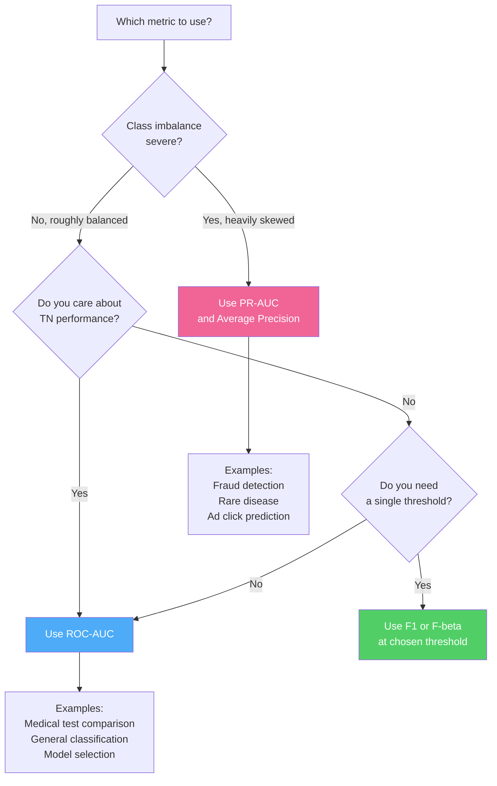

# Confusion Matrix & AUC-ROC: A Complete Reference

> A thorough visual guide to understanding model evaluation — confusion matrix anatomy, every derived metric, ROC curves, AUC, PR curves, and when to use each.

---

## Table of Contents

1. [The Confusion Matrix](#1-the-confusion-matrix)
2. [Metrics Derived from the Confusion Matrix](#2-metrics-derived-from-the-confusion-matrix)
3. [Worked Example](#3-worked-example)
4. [Multi-Class Confusion Matrix](#4-multi-class-confusion-matrix)
5. [ROC Curve](#5-roc-curve)
6. [AUC — Area Under the ROC Curve](#6-auc--area-under-the-roc-curve)
7. [Precision-Recall Curve](#7-precision-recall-curve)
8. [ROC-AUC vs PR-AUC — When to Use Which](#8-roc-auc-vs-pr-auc--when-to-use-which)
9. [Common Mistakes & Gotchas](#9-common-mistakes--gotchas)
10. [Quick Reference](#10-quick-reference)

---

## 1. The Confusion Matrix

### 1.1 What Is It?

A confusion matrix is a table that summarises every possible outcome of a binary classifier against the ground truth. It shows not just how many predictions were right, but **what kind of mistakes** the model makes.

```
                         PREDICTED
                    Positive    Negative
                  ┌───────────┬───────────┐
  ACTUAL Positive │    TP     │    FN     │  ← All real Positives
                  ├───────────┼───────────┤
         Negative │    FP     │    TN     │  ← All real Negatives
                  └───────────┴───────────┘
                       ↑            ↑
                  Predicted    Predicted
                  Positive     Negative
```

### 1.2 The Four Cells — Plain English

| Cell | Name | Meaning | Memory Hook |
|------|------|---------|-------------|
| **TP** | True Positive | Model said Positive. It IS Positive. | Correct alarm |
| **TN** | True Negative | Model said Negative. It IS Negative. | Correct silence |
| **FP** | False Positive | Model said Positive. It is NOT. | False alarm |
| **FN** | False Negative | Model said Negative. It IS Positive. | Missed detection |

### 1.3 Medical Example — Cancer Screening

```
  Ground truth: Patient HAS cancer (Positive) or DOES NOT (Negative)

                         PREDICTED
                    Has Cancer   No Cancer
                  ┌────────────┬────────────┐
  ACTUAL Has Cancer│  TP = 90  │  FN = 10  │  100 sick patients
                  ├────────────┼────────────┤
         No Cancer│  FP = 50  │  TN = 850  │  900 healthy patients
                  └────────────┴────────────┘

  TP = 90:  Correctly identified 90 cancer patients          ← GOOD
  FN = 10:  Missed 10 real cancer patients (sent home sick)  ← DANGEROUS
  FP = 50:  Healthy patients told they might have cancer     ← Costly, stressful
  TN = 850: Correctly cleared 850 healthy patients           ← GOOD
```

### 1.4 Visualising What Each Error Costs

```
  Low FN cost,            High FN cost,           High FP cost,
  Low FP cost             Low FP cost             Low FN cost
  ────────────            ────────────            ────────────
  Email spam filter       Cancer screening        Fraud detection
  Loan default            Disease diagnosis       Drug side effects
  Ad click prediction     Earthquake warning      Legal accusations

  FN = missed spam        FN = missed cancer      FP = accuse innocent
  FP = blocked legit mail FP = false alarm biopsy FN = miss real fraud

  Optimise for:           Optimise for:           Optimise for:
  Balanced accuracy       Recall (catch all sick)  Precision (be sure)
```

---

## 2. Metrics Derived from the Confusion Matrix

Every evaluation metric for a binary classifier comes from combining TP, TN, FP, FN.

### 2.1 The Metric Map

```
  ┌──────────────────────────────────────────────────────────────────────┐
  │                    Confusion Matrix Metric Tree                      │
  │                                                                      │
  │   ┌─────────────────────────────────────────────────────────────┐   │
  │   │  Total = TP + TN + FP + FN                                  │   │
  │   │  P (all actual positives) = TP + FN                         │   │
  │   │  N (all actual negatives) = TN + FP                         │   │
  │   └─────────────────────────────────────────────────────────────┘   │
  │                                                                      │
  │   Accuracy      = (TP + TN) / Total                                  │
  │   Precision     = TP / (TP + FP)            [of predicted +, how many real?]│
  │   Recall/TPR    = TP / (TP + FN)            [of real +, how many caught?]   │
  │   Specificity   = TN / (TN + FP)            [of real -, how many caught?]   │
  │   FPR           = FP / (FP + TN)   = 1 - Specificity                │
  │   FNR           = FN / (FN + TP)   = 1 - Recall                     │
  │   F1 Score      = 2 × Precision × Recall / (Precision + Recall)     │
  │   F-beta        = (1+β²) × P × R / (β²×P + R)                       │
  │   MCC           = (TP×TN - FP×FN) / sqrt((TP+FP)(TP+FN)(TN+FP)(TN+FN))│
  │   Balanced Acc  = (TPR + TNR) / 2                                    │
  └──────────────────────────────────────────────────────────────────────┘
```

### 2.2 Each Metric Explained

#### Accuracy

$$\text{Accuracy} = \frac{TP + TN}{TP + TN + FP + FN}$$

```
  What it measures: overall fraction of correct predictions

  ✓ Intuitive, easy to explain
  ✗ MISLEADING on imbalanced datasets

  Example: 99% of emails are not spam
  A model that ALWAYS predicts "not spam" gets 99% accuracy
  but catches zero spam — useless!
```

#### Precision (Positive Predictive Value)

$$\text{Precision} = \frac{TP}{TP + FP}$$

```
  What it measures: "Of everything I flagged as Positive,
                     what fraction was actually Positive?"

  High precision → few false alarms
  Low precision  → lots of false alarms

  ┌──────────────────────────────────────────────────┐
  │  Predicted Positive bucket:  [TP TP TP TP FP FP] │
  │  Precision = 4/6 = 0.67                          │
  └──────────────────────────────────────────────────┘

  Use when FP is costly:
  - Drug approval: don't approve ineffective drugs
  - Legal: don't accuse innocent people
```

#### Recall (Sensitivity / True Positive Rate)

$$\text{Recall} = \frac{TP}{TP + FN}$$

```
  What it measures: "Of all the real Positives in the dataset,
                     what fraction did I find?"

  High recall → few missed positives
  Low recall  → many missed positives

  ┌──────────────────────────────────────────────────┐
  │  All actual Positives:  [TP TP TP TP FN FN FN]   │
  │  Recall = 4/7 = 0.57                             │
  └──────────────────────────────────────────────────┘

  Use when FN is costly:
  - Cancer screening: don't miss sick patients
  - Earthquake detection: don't miss earthquakes
```

#### The Precision-Recall Trade-off

```
  Threshold = 0.9 (very strict — only predict Positive if very sure):
    Precision HIGH  (few false alarms, very picky)
    Recall    LOW   (misses many real positives)

  Threshold = 0.1 (very loose — predict Positive for almost everything):
    Precision LOW   (lots of false alarms)
    Recall    HIGH  (catches almost all real positives)

  ↑ Precision
  1│ ╲
   │  ╲
   │   ╲
   │    ╲
   │     ╲
  0└──────────► Recall
   0          1

  Moving threshold trades one for the other — can't maximise both freely
```

#### F1 Score

$$F_1 = \frac{2 \times \text{Precision} \times \text{Recall}}{\text{Precision} + \text{Recall}} = \frac{2 \cdot TP}{2 \cdot TP + FP + FN}$$

```
  Harmonic mean of Precision and Recall.
  Punishes extreme imbalance between the two.

  Example:
  Model A: Precision=0.9, Recall=0.1  → F1 = 2×0.9×0.1/(0.9+0.1) = 0.18
  Model B: Precision=0.5, Recall=0.5  → F1 = 2×0.5×0.5/(0.5+0.5) = 0.50

  Model A has higher precision but F1 reveals it's worse overall.

  F1 range: [0, 1]. Higher is better.
  F1 = 1: perfect precision AND recall
  F1 = 0: either precision or recall is 0
```

#### F-beta Score

$$F_\beta = \frac{(1 + \beta^2) \times \text{Precision} \times \text{Recall}}{\beta^2 \times \text{Precision} + \text{Recall}}$$

```
  β controls the balance:

  β < 1: weight precision more (FP worse than FN)
  β = 1: equal weight (standard F1)
  β > 1: weight recall more (FN worse than FP)

  Common choices:
  F0.5: precision-heavy  → legal decisions, content moderation
  F1:   balanced         → general purpose
  F2:   recall-heavy     → medical diagnosis, hazard detection
```

#### Specificity (True Negative Rate)

$$\text{Specificity} = \frac{TN}{TN + FP}$$

```
  "Of all real Negatives, what fraction did I correctly identify?"
  Complement of FPR (False Positive Rate).

  High specificity → rarely raises false alarms about negatives
  Important when: healthy patients should not be alarmed unnecessarily
```

#### Matthews Correlation Coefficient (MCC)

$$\text{MCC} = \frac{TP \times TN - FP \times FN}{\sqrt{(TP+FP)(TP+FN)(TN+FP)(TN+FN)}}$$

```
  Range: [-1, +1]
   +1: perfect predictions
    0: random guessing
   -1: perfectly wrong

  MCC is the MOST INFORMATIVE single metric for binary classification.
  Unlike accuracy and F1, MCC accounts for all four cells equally.
  Robust to class imbalance.

  Example (imbalanced: 950 neg, 50 pos):
  Model always predicts Negative:
    Accuracy = 950/1000 = 0.95   ← looks great!
    F1       = 0                 ← reveals it's useless
    MCC      = 0                 ← also reveals it's useless
```

#### Balanced Accuracy

$$\text{Balanced Accuracy} = \frac{\text{TPR} + \text{TNR}}{2} = \frac{\text{Recall} + \text{Specificity}}{2}$$

```
  Average of sensitivity and specificity.
  Equivalent to accuracy if classes are balanced.
  Better than raw accuracy for imbalanced datasets.

  Model always predicts Negative (950 neg, 50 pos):
    Accuracy          = 0.95
    Balanced Accuracy = (0.0 + 1.0) / 2 = 0.50  ← exposed as coin-flip
```

---

## 3. Worked Example

### 3.1 Binary Classification — Email Spam

```
  Dataset: 1000 emails, 200 spam (Positive), 800 not spam (Negative)

  Model predictions after choosing threshold = 0.5:

                         PREDICTED
                    Spam      Not Spam
                  ┌──────────┬──────────┐
  ACTUAL    Spam  │ TP = 160 │ FN = 40  │  200 spam emails
                  ├──────────┼──────────┤
          Not Spam│ FP = 30  │ TN = 770 │  800 legit emails
                  └──────────┴──────────┘

  Computing all metrics:
  ──────────────────────────────────────────────────────────────
  Accuracy         = (160 + 770) / 1000        = 0.93  (93%)
  Precision        = 160 / (160 + 30)          = 0.842 (84.2%)
  Recall           = 160 / (160 + 40)          = 0.80  (80%)
  Specificity      = 770 / (770 + 30)          = 0.963 (96.3%)
  FPR              = 30 / (30 + 770)           = 0.038 (3.8%)
  F1               = 2×0.842×0.80/(0.842+0.80) = 0.820
  MCC              = (160×770 - 30×40) / sqrt((190)(200)(800)(810))
                   = (123200 - 1200) / sqrt(24681600000)
                   = 122000 / 157102 ≈ 0.777
  Balanced Acc     = (0.80 + 0.963) / 2        = 0.882
```

### 3.2 What Happens When We Change the Threshold

```
  Same model, different classification thresholds:

  Threshold  TP    FP   FN   TN    Precision  Recall   F1
  ─────────────────────────────────────────────────────────
  0.90       110   5    90   795   0.957      0.550    0.699
  0.70       140   15   60   785   0.903      0.700    0.789
  0.50       160   30   40   770   0.842      0.800    0.820  ← default
  0.30       180   70   20   730   0.720      0.900    0.800
  0.10       195   150  5    650   0.565      0.975    0.715

  ↑ Higher threshold: model is picky → high precision, low recall
  ↓ Lower threshold: model is liberal → high recall, low precision

  How do we pick the best threshold? → ROC curve!
```

---

## 4. Multi-Class Confusion Matrix

### 4.1 Structure

For K classes, the confusion matrix is K × K:

```
  3-class example: classify images as Cat, Dog, or Bird

                        PREDICTED
                   Cat    Dog    Bird
               ┌───────┬───────┬───────┐
  ACTUAL  Cat  │  50   │   3   │   2   │  55 actual cats
               ├───────┼───────┼───────┤
          Dog  │   4   │  42   │   4   │  50 actual dogs
               ├───────┼───────┼───────┤
          Bird │   1   │   2   │  47   │  50 actual birds
               └───────┴───────┴───────┘

  Diagonal = correct predictions
  Off-diagonal = mistakes (which class confused for which)

  Observations:
  - Cats and Dogs confused with each other (4 Dog→Cat, 3 Cat→Dog)
  - Birds rarely confused with anything
  - Dog model is weakest (4 misclassified as Cat, 4 as Bird)
```

### 4.2 Per-Class Metrics

For each class $c$, treat it as a one-vs-rest binary problem:

```
  Class "Cat":
    TP = 50  (correctly predicted Cat)
    FP = 4+1 = 5  (Dog or Bird predicted as Cat)
    FN = 3+2 = 5  (Cat predicted as Dog or Bird)
    TN = 42+4+2+47 = 95  (non-Cat correctly not predicted as Cat)

  Precision_Cat = 50/(50+5) = 0.909
  Recall_Cat    = 50/(50+5) = 0.909
  F1_Cat        = 0.909
```

### 4.3 Macro, Micro, Weighted Averaging

```
  Macro average: unweighted mean across classes
  ─────────────────────────────────────────────
  Macro-F1 = (F1_Cat + F1_Dog + F1_Bird) / 3
  Treats all classes equally, regardless of size.
  Good for: balanced datasets, when minority class matters equally.

  Micro average: aggregate TP/FP/FN across all classes first
  ──────────────────────────────────────────────────────────
  Micro-F1 = (TP_Cat + TP_Dog + TP_Bird) / (TP + FP + FN) all summed
  Dominated by the most frequent class.
  Good for: imbalanced datasets, when you care about overall volume.

  Weighted average: weight each class F1 by its support (sample count)
  ────────────────────────────────────────────────────────────────────
  Weighted-F1 = Σ (class_weight × F1_class)
  Good for: imbalanced datasets where larger classes matter more.
```

---

## 5. ROC Curve

### 5.1 What Is the ROC Curve?

The **Receiver Operating Characteristic** curve plots the True Positive Rate (Recall) against the False Positive Rate at every possible classification threshold from 0 to 1.

```
  ↑ TPR (Recall)
  │ 1.0                        ★ Perfect classifier
  │                          ╱
  0.9          ╭────────────╯  ← Real model curve
  │          ╭╯
  0.8       ╱
  │       ╱
  0.7    ╱
  │    ╱
  0.6  ╱             AUC = area under this curve
  │  ╱
  0.5╱
  │╱ ─ ─ ─ ─ ─ ─ ─ ─ ─ ─ ─ ─  ← Random classifier (diagonal)
  ╱
  └─────────────────────────────────────────► FPR
  0   0.1  0.2  0.3  0.4  0.5  0.6  0.7  0.8  0.9  1.0
```

### 5.2 How the ROC Curve Is Built

```
  Algorithm:
  1. Get model's predicted probability for each sample
  2. Sort samples by predicted probability (high to low)
  3. Sweep threshold from 1.0 down to 0.0
  4. At each threshold: compute (FPR, TPR)
  5. Plot each (FPR, TPR) point

  Step-by-step with 10 samples:
  ──────────────────────────────────────────────────
  Sample  True Label  Pred Prob   Threshold sweep →
  ──────────────────────────────────────────────────
  A       Pos         0.95         ↓ lower threshold
  B       Pos         0.88         each step adds
  C       Neg         0.82         one more prediction
  D       Pos         0.71         to the Positive bucket
  E       Neg         0.65
  F       Pos         0.60
  G       Neg         0.53
  H       Neg         0.42
  I       Pos         0.35
  J       Neg         0.21

  At threshold=0.95: predict A=Pos, rest=Neg
    TP=1, FP=0, FN=4, TN=5 → TPR=0.2, FPR=0.0   → point (0.0, 0.2)

  At threshold=0.82: predict A,B,C=Pos, rest=Neg
    TP=2, FP=1, FN=3, TN=4 → TPR=0.4, FPR=0.2   → point (0.2, 0.4)

  At threshold=0.60: predict A,B,C,D,E,F=Pos
    TP=4, FP=2, FN=1, TN=3 → TPR=0.8, FPR=0.4   → point (0.4, 0.8)

  At threshold=0.0:  predict everything=Pos
    TP=5, FP=5, FN=0, TN=0 → TPR=1.0, FPR=1.0   → point (1.0, 1.0)
```

### 5.3 What Different ROC Curves Look Like

```
  ↑ TPR
  1│
   │   ★                    ╭────
   │  ╱╲       ╭──────────╯  Good model (AUC ≈ 0.85)
   │╱   ╲    ╭╯
   │     ╲  ╱     ╭──────── Average model (AUC ≈ 0.70)
   │      ╲╱    ╭╯
   │           ╱
   │ ─ ─ ─ ─ ╱─ ─ ─ ─ ─ ─  Random (AUC = 0.50)
   │         ╱
   │        ╱
   │       ╱ ←── Worse than random (AUC < 0.50) — flip predictions!
   └──────────────────────────► FPR
   0                          1

  Corner hugging (top-left) = better model
  Diagonal = random guessing
  Below diagonal = worse than random (just flip the predictions)
```

### 5.4 Reading the ROC Curve — Operating Points

```
  ↑ TPR
  1│                     ●  ← threshold=0.0 (predict all Positive)
   │                  ╭──╯    TPR=1.0, FPR=1.0
   │               ╭──╯
   │         ●─────╯     ← threshold=0.3
   │       ╭─╯             TPR=0.88, FPR=0.15
   │      ╱               ← Good operating point
   │    ╭╯
   │   ╱ ● ← threshold=0.7
   │  ╱    TPR=0.60, FPR=0.05
   │ ╱
   │╱● ← threshold=0.9
   │    TPR=0.20, FPR=0.01
   └─────────────────────────────────────► FPR

  Youden's J: max(TPR - FPR) → optimal threshold
  J = TPR - FPR = Sensitivity + Specificity - 1
```

---

## 6. AUC — Area Under the ROC Curve

### 6.1 What AUC Means

$$\text{AUC} = \int_0^1 \text{TPR}(\text{FPR}) \, d(\text{FPR})$$

```
  AUC is the probability that the model ranks a random
  positive example higher than a random negative example.

  AUC = 0.85 means:
  Pick one random spam email and one random legit email.
  The model will assign a higher spam-probability to the spam
  email 85% of the time.

  ┌───────────────────────────────────────────────┐
  │  AUC = 1.0 : Perfect — always ranks pos > neg │
  │  AUC = 0.9 : Excellent                        │
  │  AUC = 0.8 : Good                             │
  │  AUC = 0.7 : Fair                             │
  │  AUC = 0.6 : Poor                             │
  │  AUC = 0.5 : Random guessing                  │
  │  AUC < 0.5 : Worse than random (flip labels!) │
  └───────────────────────────────────────────────┘
```

### 6.2 Why AUC Is Threshold-Independent

```
  Accuracy, Precision, Recall, F1 all depend on a chosen threshold.
  AUC summarises performance ACROSS ALL thresholds at once.

  This makes AUC useful for:
  ✓ Comparing models before choosing a deployment threshold
  ✓ Evaluating ranking quality
  ✓ Imbalanced datasets (less sensitive than accuracy)
  ✗ When you need to know performance at one specific threshold
  ✗ When the costs of FP and FN are very asymmetric
     (use PR-AUC instead for heavy class imbalance)
```

### 6.3 Computing AUC — The Trapezoidal Rule

```
  ROC points: (0.0, 0.0), (0.1, 0.4), (0.3, 0.7), (0.6, 0.9), (1.0, 1.0)

  AUC ≈ sum of trapezoids between consecutive points:

  Trapezoid formula:
  Area = (FPR₂ - FPR₁) × (TPR₁ + TPR₂) / 2

  Step 1: (0.0→0.1): width=0.1, heights=0.0,0.4 → area = 0.1×(0.0+0.4)/2 = 0.020
  Step 2: (0.1→0.3): width=0.2, heights=0.4,0.7 → area = 0.2×(0.4+0.7)/2 = 0.110
  Step 3: (0.3→0.6): width=0.3, heights=0.7,0.9 → area = 0.3×(0.7+0.9)/2 = 0.240
  Step 4: (0.6→1.0): width=0.4, heights=0.9,1.0 → area = 0.4×(0.9+1.0)/2 = 0.380

  AUC ≈ 0.020 + 0.110 + 0.240 + 0.380 = 0.750
```

### 6.4 AUC via the Wilcoxon-Mann-Whitney Statistic

AUC has a non-parametric interpretation — it equals the probability that the model scores a positive higher than a negative:

$$\text{AUC} = P(\hat{p}_{\text{pos}} > \hat{p}_{\text{neg}})$$

Computable by counting concordant pairs:

```
  Positives: scores = [0.9, 0.7, 0.6]
  Negatives: scores = [0.4, 0.3, 0.2]

  All pairs (3×3 = 9 pairs):
  (0.9 vs 0.4): 0.9 > 0.4 ✓ concordant
  (0.9 vs 0.3): 0.9 > 0.3 ✓ concordant
  (0.9 vs 0.2): 0.9 > 0.2 ✓ concordant
  (0.7 vs 0.4): 0.7 > 0.4 ✓ concordant
  (0.7 vs 0.3): 0.7 > 0.3 ✓ concordant
  (0.7 vs 0.2): 0.7 > 0.2 ✓ concordant
  (0.6 vs 0.4): 0.6 > 0.4 ✓ concordant
  (0.6 vs 0.3): 0.6 > 0.3 ✓ concordant
  (0.6 vs 0.2): 0.6 > 0.2 ✓ concordant

  AUC = 9/9 = 1.0  (perfect ranking in this tiny example)
```

### 6.5 Comparing Models with ROC Curves

```
  ↑ TPR
  1│
   │        ●─────────────────────────────────────●
   │      ╭─╯                                    ╭╯
   │     ╱   Model A (AUC=0.92) ─────────────────╯
   │    ╱
   │   ╱
   │  ╱    Model B (AUC=0.78)
   │ ╱  ╭──────────────────────────────────────────
   │╱╭──╯
   │╱    ─ ─ ─ ─ ─  Random (AUC=0.50)
   └────────────────────────────────────────────► FPR

  Model A dominates Model B across all thresholds → clearly better.

  What if curves cross?
  ─────────────────────
  Model A: better at low FPR (conservative regime)
  Model B: better at high FPR (liberal regime)
  → Choose based on your operating point, not AUC alone
```

---

## 7. Precision-Recall Curve

### 7.1 Construction

Instead of plotting TPR vs FPR, plot Precision vs Recall at every threshold:

```
  ↑ Precision
  1│●  ← threshold very high (predict very few Positives)
   │ ╲   Precision=1.0, Recall=0.1
   │  ╲
  0.9│  ╲
   │   ╲
  0.8│   ╲────
   │        ╲
  0.7│        ╲──────
   │               ╲────
  0.6│                   ╲────────
   │                            ╲──── ← threshold very low
  0.5│                                ●  Recall=1.0, Precision=0.5
   └──────────────────────────────────────────► Recall
   0   0.1  0.2  0.3  0.4  0.5  0.6  0.7  0.8  0.9  1.0

  Ideal curve: hugs the top-right corner (high precision at high recall)
  Baseline: horizontal line at Precision = P/(P+N) = class prevalence
```

### 7.2 Average Precision (AP)

$$\text{AP} = \sum_{k} (R_k - R_{k-1}) \times P_k$$

Weighted area under the PR curve, where weights are the increase in recall at each step. Equivalent to the mean of precisions at each recall threshold.

```
  AP = 1.0 : perfect — maximum precision at every recall level
  AP = 0.5 : baseline for 50% positive class prevalence
  AP is always relative to class imbalance (unlike AUC-ROC)
```

---

## 8. ROC-AUC vs PR-AUC — When to Use Which

### 8.1 Side-by-Side Comparison

```
  ┌────────────────────┬──────────────────────┬─────────────────────┐
  │ Property           │ ROC-AUC              │ PR-AUC              │
  ├────────────────────┼──────────────────────┼─────────────────────┤
  │ Axes               │ TPR vs FPR           │ Precision vs Recall │
  │ Baseline           │ 0.5 (random)         │ = class prevalence  │
  │ Class imbalance    │ Optimistic (inflated) │ Realistic           │
  │ TN influence       │ Yes (via FPR)        │ No                  │
  │ Use when           │ Balanced classes     │ Heavy imbalance     │
  │ Example task       │ Medical (50/50)      │ Fraud (0.1%)        │
  └────────────────────┴──────────────────────┴─────────────────────┘
```

### 8.2 Why ROC-AUC Can Be Misleading for Imbalanced Data

```
  Dataset: 9900 Negative, 100 Positive (1% positive rate)
  Model: predicts Positive for 200 samples

  TP=90, FP=110, FN=10, TN=9790

  ROC-AUC components:
  TPR = 90/100 = 0.90
  FPR = 110/9900 = 0.011

  Point (0.011, 0.90) looks great on ROC curve → AUC ≈ 0.95

  PR-AUC components:
  Precision = 90/200 = 0.45  ← only 45% of Positive predictions are right!
  Recall    = 90/100 = 0.90

  PR curve tells the real story: despite high recall, precision is poor.

  Why? FPR is diluted by the massive TN count (9790).
       PR curve doesn't use TN at all → more honest about positive class performance.
```

### 8.3 Decision Guide



---

## 9. Common Mistakes & Gotchas

### 9.1 Accuracy on Imbalanced Data

```
  DON'T: report accuracy on imbalanced datasets

  Credit card fraud: 99.9% non-fraud, 0.1% fraud
  Model that always says "not fraud":
    Accuracy = 99.9%   ← sounds amazing
    Recall   = 0%      ← catches zero fraud!
    F1       = 0%      ← useless

  DO: use F1, MCC, PR-AUC, or Balanced Accuracy
```

### 9.2 Optimising the Wrong Metric

```
  Mistake: optimise AUC but deploy with fixed threshold → accuracy suffers
  Fix: after choosing model by AUC, calibrate threshold on validation set

  Mistake: report macro-F1 on imbalanced data
  Fix: use weighted-F1 or per-class F1 with sample counts

  Mistake: use accuracy when classes cost differently
  Fix: cost-sensitive learning → weight FP and FN by their business cost
```

### 9.3 Data Leakage in Evaluation

```
  Never compute evaluation metrics on training data.
  Use a held-out test set that the model has NEVER seen.

  Correct split:
  ┌──────────────────────────────────────────────────┐
  │  All data                                        │
  │  ├── Train set (60-70%) — used to fit model      │
  │  ├── Val set   (10-20%) — used to tune threshold │
  │  └── Test set  (10-20%) — used ONCE for metrics  │
  └──────────────────────────────────────────────────┘
```

### 9.4 Threshold ≠ 0.5 by Default

```
  0.5 is not always the right threshold. Choose based on:

  Method 1 — Youden's J (maximise TPR - FPR):
    Scan thresholds, pick one that maximises (TPR - FPR)

  Method 2 — Business cost:
    Cost(FP) = $10 (investigate a legit transaction)
    Cost(FN) = $500 (miss real fraud)
    Optimal threshold minimises: Cost(FP)×FP + Cost(FN)×FN

  Method 3 — F1/Fbeta maximisation:
    Scan thresholds, pick one that maximises F1 on validation set

  Method 4 — Fixed operating point:
    "We must catch at least 95% of fraud" → set threshold so Recall >= 0.95
```

### 9.5 Micro vs Macro — Which to Report?

```
  Multi-class with class imbalance:

  Classes:   Cat (1000), Dog (100), Bird (10)
  F1 scores: Cat=0.90,   Dog=0.70,  Bird=0.40

  Macro-F1    = (0.90 + 0.70 + 0.40) / 3 = 0.667
  Weighted-F1 = (1000×0.90 + 100×0.70 + 10×0.40) / 1110 = 0.877

  Macro treats Bird the same as Cat → penalises poor rare-class performance
  Weighted reflects overall volume → dominated by Cat

  Report BOTH and explain the imbalance.
```

---

## 10. Quick Reference

### 10.1 All Metrics at a Glance

```
  ┌────────────────────┬────────────────────────────────────┬──────────────────┐
  │ Metric             │ Formula                            │ Use when         │
  ├────────────────────┼────────────────────────────────────┼──────────────────┤
  │ Accuracy           │ (TP+TN) / Total                    │ Balanced classes │
  │ Precision          │ TP / (TP+FP)                       │ FP is costly     │
  │ Recall / TPR       │ TP / (TP+FN)                       │ FN is costly     │
  │ Specificity / TNR  │ TN / (TN+FP)                       │ Need TN quality  │
  │ FPR                │ FP / (FP+TN)  = 1 - Specificity    │ ROC x-axis       │
  │ F1                 │ 2PR / (P+R)                        │ Balanced P and R │
  │ F-beta             │ (1+b²)PR / (b²P+R)                 │ Tune P/R weight  │
  │ MCC                │ (TP·TN - FP·FN) / sqrt(...)        │ Best single metric│
  │ Balanced Accuracy  │ (TPR + TNR) / 2                    │ Imbalanced data  │
  │ AUC-ROC            │ Area under TPR vs FPR curve        │ Model comparison │
  │ AUC-PR             │ Area under Precision vs Recall      │ Heavy imbalance  │
  │ Average Precision  │ Weighted area under PR curve        │ Object detection │
  └────────────────────┴────────────────────────────────────┴──────────────────┘
```

### 10.2 Confusion Matrix Anatomy Cheatsheet

```
                         PREDICTED
                    Positive      Negative
                  ┌─────────────┬─────────────┐
  ACTUAL Positive │     TP      │     FN      │   Recall = TP/(TP+FN)
                  ├─────────────┼─────────────┤
         Negative │     FP      │     TN      │   Specificity = TN/(TN+FP)
                  └─────────────┴─────────────┘
                        │              │
              Precision  │              │
              =TP/(TP+FP)│              │ NPV = TN/(TN+FN)
                         ▼              ▼
                   All Predicted+   All Predicted-
```

### 10.3 AUC Score Interpretation

```
  AUC = 1.00  ████████████████  Perfect
  AUC = 0.95  ███████████████   Excellent
  AUC = 0.85  █████████████     Good
  AUC = 0.75  ███████████       Fair
  AUC = 0.65  █████████         Poor
  AUC = 0.55  ███████           Very poor
  AUC = 0.50  █████             Random — model has no discrimination ability
  AUC < 0.50  ████              Worse than random — flip your predictions!
```

### 10.4 Choosing Your Threshold

```
  Goal                        → Threshold Strategy
  ──────────────────────────────────────────────────────────────
  Maximise F1                 → argmax_t F1(t) on validation set
  Minimise misclassification  → argmax_t Accuracy(t)
  Fix recall at 95%           → min threshold where Recall >= 0.95
  Maximise TPR - FPR          → Youden's J statistic
  Minimise business cost      → argmin_t [cost_FP×FP(t) + cost_FN×FN(t)]
  Equal error rate            → threshold where FPR = FNR (EER)
```

---

*Pair this with the [ML Loss Functions reference](./ml_loss_functions.md) for the training objectives that produce the scores being evaluated here, and the [RAG Systems reference](./rag_systems.md) for retrieval evaluation (Precision@k, NDCG, MRR) which extends these ideas to ranked lists.*
